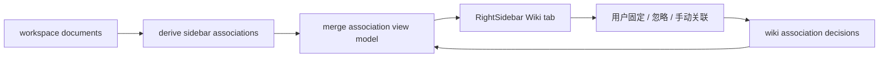

# P0.3 Wiki 关联线索确认与固化设计

**Date:** 2026-05-18  
**Status:** Product design  
**Related SPEC:** `docs/requirements/specs/wiki_association_confirmation_spec.md`

## 1. 背景

P0.2 已经把右侧栏 Wiki 关联拆成属性 / Wiki tab，并在 Wiki tab 中按目标文档聚合 `主题相似`、`局部相似`、`原文命中` 证据。短句、列表项和关键句原文命中也已经作为线索层补入召回。

当前产品断点不再是“系统能不能发现线索”，而是“用户发现线索之后如何判断、采纳、沉淀和减少噪音”。如果继续扩大算法召回，而没有用户确认层，右侧栏会逐渐变成不可控的推荐列表。

## 2. 目标

1. 让用户能把有价值的 Wiki 关联长期保留。
2. 让用户能隐藏误命中，避免同一类噪音反复出现。
3. 让算法发现和用户确认分层：算法负责候选，用户负责知识结构沉淀。
4. 提供比 hover 更完整的线索详情，让用户能判断为什么某个文档相关。

## 3. 方案比较

| 方案 | 内容 | 优点 | 风险 |
|---|---|---|---|
| A. 继续增强算法召回 | 继续扩展短文语义、标题相似、更多规则 | 看起来更智能 | 噪音增加，用户仍无法处理线索 |
| B. 增加用户确认层 | 支持固定、忽略、手动关联、查看全部线索 | 闭环完整，能沉淀真实关系 | 需要新增本地持久化状态和合并逻辑 |
| C. 直接做图谱视图 | 把关系可视化出来 | 感知强，适合展示 | 数据关系还未被用户确认，图谱容易放大误关联 |

推荐方案 B。理由是它补的是知识管理闭环，而不是展示形式。先有可确认的关系，后续图谱、模板、元数据和智能辅助才有更可信的数据基础。

## 4. 产品形态

右侧栏 Wiki tab 保持两层结构：显式引用和关联文档。P0.3 在关联文档卡片上增加处理动作：

1. `固定`：保留该目标文档，后续优先展示。
2. `忽略`：隐藏该目标文档的算法关联，并提供恢复入口。
3. `转为手动关联`：将该关系固化为用户确认关系，但不自动改写正文。
4. `查看全部线索`：进入右侧栏内详情视图，查看该目标文档的全部证据。

详情视图不使用主编辑区弹窗，避免打断阅读和编辑。它在右侧栏内替换列表内容，并提供返回入口。

## 5. 数据流

本地状态建议使用 `wiki_association_decisions` 保存：

1. `workspaceId`
2. `sourceDocumentId`
3. `targetDocumentId`
4. `status`: `pinned` / `manual` / `ignored`
5. `createdAt`
6. `updatedAt`

`(workspaceId, sourceDocumentId, targetDocumentId)` 保持唯一。后一次用户动作覆盖前一次状态。

## 6. 展示规则

1. `manual` 优先于 `pinned`，`pinned` 优先于普通算法关联。
2. `ignored` 不进入普通关联列表，也不计入 Wiki tab 角标。
3. 固定和手动关联即使当前证据消失，也可继续展示，并提示 `暂无当前线索`。
4. 忽略只影响算法关联，不隐藏真正的文档提及、出链和反向链接。
5. 当前版本不自动插入正文提及，避免静默修改用户文档。

## 7. 验收重点

1. 用户确认状态能在重启、切换文档后保留。
2. 固定、忽略、手动关联和恢复动作均可逆。
3. Wiki tab 角标与已忽略状态联动正确。
4. 详情视图能展示完整证据，并支持点击原文证据定位和高亮。
5. 右侧栏展示模型由 prepared association state 与本地确认状态合并得出，不把持久化读写塞进纯展示组件。

## 8. 下一步开发拆分

1. 增加本地确认状态 schema、repository 和 migration tests。
2. 扩展 association view model 合并逻辑，覆盖 pinned / manual / ignored。
3. 更新 RightSidebar UI：卡片动作、状态标签、详情视图和已忽略恢复入口。
4. 补充 RightSidebar rendering tests、association merge tests 和端到端手工验收。
