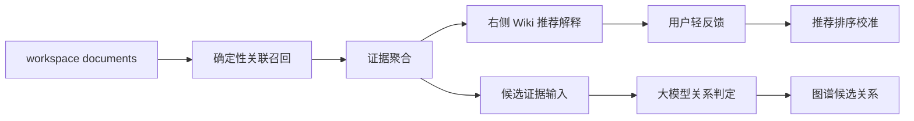

# P0.3 Wiki 关联推荐与智能判定设计

**Date:** 2026-05-18
**Status:** Product design
**Related SPEC:** `docs/requirements/specs/wiki_association_intelligent_judgement_spec.md`

## 1. 背景修正

P0.2 已经让右侧 Wiki 能展示关联文档，并将 `主题相似`、`局部相似`、`原文命中` 聚合到目标文档下。短句、列表项和关键句原文命中也已经能作为线索召回。

上一版 P0.3 设计把重点放在“用户确认与固化”，这会把右侧 Wiki 从推荐辅助变成审核任务，增加用户操作负担。更准确的产品方向是：右侧 Wiki 负责推荐和解释；如果要形成有效关联图谱，应由大模型在后台进行关系判定，而不是要求用户逐条手动确认。

## 2. 目标

1. 右侧 Wiki 保持推荐体验，不变成待处理队列。
2. 用户可以理解为什么推荐某个文档，包括证据类型、命中原文和简短理由。
3. 用户可以查看某个目标文档的全部线索，而不是只依赖 hover 小浮层。
4. 用户反馈保持轻量可选，只用于推荐排序和降噪。
5. 面向未来图谱，建立“大模型关系判定”路径：判断关系是否成立、关系类型、置信度和理由。

## 3. 方案比较

| 方案 | 内容 | 优点 | 风险 |
|---|---|---|---|
| A. 用户逐条确认 | 固定、忽略、手动关联 | 数据可控 | 增加操作负担，违背右侧 Wiki 推荐定位 |
| B. 推荐解释 + 轻反馈 | 展示理由、全部线索、可选反馈 | 体验轻，符合推荐面板定位 | 不能独立产出高可信图谱 |
| C. 推荐解释 + 大模型判定 | 右侧推荐解释，后台模型判断关系并生成图谱候选 | 兼顾体验和图谱质量 | 需要模型配置、权限和数据边界设计 |

推荐方案 C，分阶段落地。P0.3 先做推荐解释和全部线索体验；大模型判定进入 P1 或智能辅助专项，作为图谱候选的基础能力。

## 4. 产品形态

右侧 Wiki 保持两层结构：

1. 显式引用：文档提及、出链、反链，来自用户真实内容动作。
2. 推荐关联文档：系统基于相似和原文证据生成的推荐。

推荐关联文档卡片增加：

1. 推荐理由：例如 `命中关键句`、`3 条原文线索`、`主题相似`。
2. 全部线索入口：进入右侧栏详情视图，按证据类型分组展示。
3. 轻反馈入口：`有用`、`少展示类似内容`，可选且低打扰。
4. 智能判定状态预留：未来展示 `可能形成图谱关系`、关系类型和置信度。

## 5. 数据流

P0.3 可以只做到 `Evidence -> Wiki` 和轻反馈 UI 预留，不强制实现大模型。模型能力要单独评审数据边界。

## 6. 大模型判定边界

大模型判定不是“语义搜索替代品”，而是对已经召回的候选关系做二次判断。输入应尽量小而可解释：

1. 当前文档标题和相关片段。
2. 目标文档标题和命中片段。
3. 证据类型：原文命中、局部相似、主题相似、显式引用。
4. 需要模型输出：是否成关系、关系类型、置信度、理由、引用证据。

未配置模型时，WorkKnowlage 仍正常展示本地确定性推荐；不能因为模型不可用影响编辑和阅读。

## 7. 验收重点

1. 右侧 Wiki 不要求用户逐条确认。
2. 每个推荐关联文档能解释“为什么推荐”。
3. 全部线索详情能替代 hover 作为完整证据查看入口。
4. 点击原文证据仍能跳转并高亮目标文本。
5. 轻反馈是可选的，不能阻断用户打开目标文档。
6. 大模型判定设计保留数据边界，不默认上传本地文档。

## 8. 下一步开发拆分

1. 扩展关联文档 view model：推荐理由、证据强度、详情数据。
2. 更新右侧栏 UI：全部线索详情、推荐理由、轻反馈入口。
3. 增加轻反馈本地状态的最小模型，先用于当前会话或本地降噪。
4. 单独设计大模型关系判定服务和数据边界，再进入图谱候选开发。
