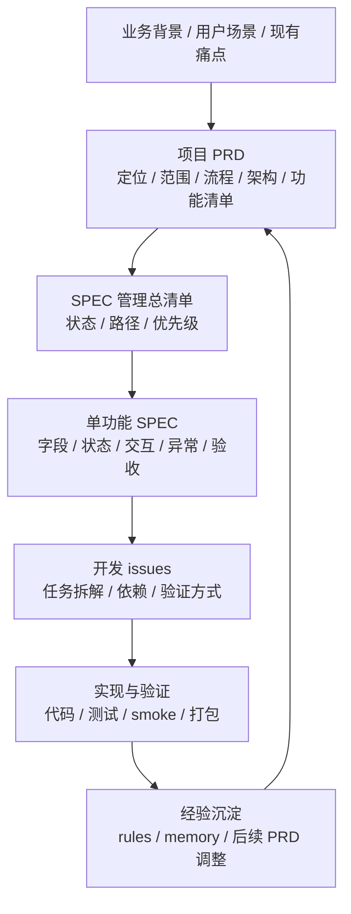
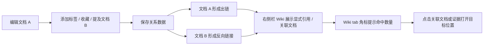
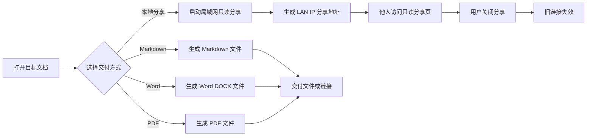
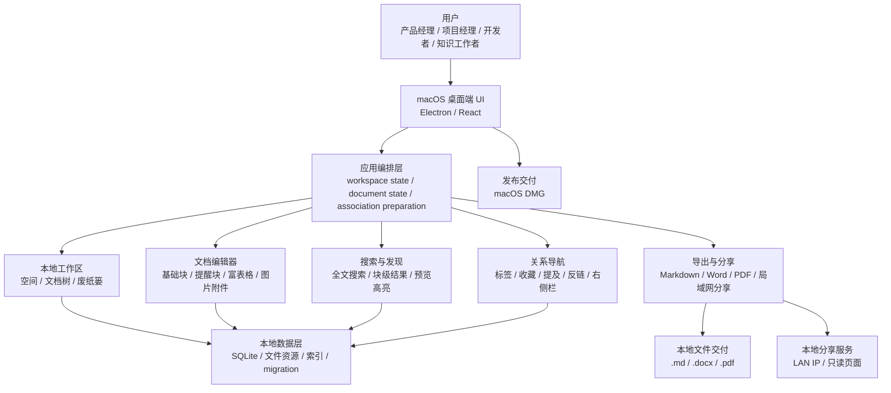
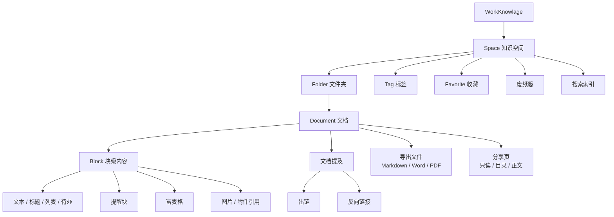
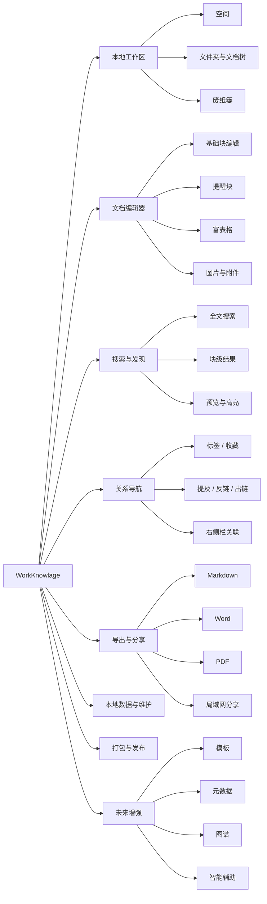

# WorkKnowlage 产品需求文档 PRD

> 文档元信息
> - 版本：v1.0 草稿
> - Owner：Lusice
> - 作者：Codex based on Lusice context
> - 最后更新：2026-05-15
> - 产品范围：WorkKnowlage 本地知识工作台
> - 文档定位：项目级 PRD，负责产品方向、功能范围、需求说明、里程碑和风险
> - 关联文档：`README.md`、`docs/agents/`、`.scratch/`

---

## 目录

1. [变更记录](#1-变更记录)
2. [背景介绍](#2-背景介绍)
3. [产品目标与定位](#3-产品目标与定位)
4. [目标用户与业务场景](#4-目标用户与业务场景)
5. [业务流程与需求流程](#5-业务流程与需求流程)
6. [系统概述与功能清单](#6-系统概述与功能清单)
7. [SPEC 管理总清单](#7-spec-管理总清单)
8. [需求说明](#8-需求说明)
9. [非功能需求](#9-非功能需求)
10. [验收标准总览](#10-验收标准总览)
11. [里程碑与版本规划](#11-里程碑与版本规划)
12. [风险与待确认问题](#12-风险与待确认问题)
13. [附录](#13-附录)

---

## 1. 变更记录

| 版本 | 作者 | 修订内容 | 发布日期 |
|---|---|---|---|
| v0.1 | Codex | 初版项目级 PRD | 2026-05-13 |
| v0.2 | Codex | 曾按 Agent PRD 结构补充 AI 相关章节 | 2026-05-13 |
| v0.3 | Codex | 修正产品定位：WorkKnowlage 不是 AI 产品；改为产品 PRD + 需求规格说明书结构 | 2026-05-13 |
| v0.4 | Codex | 明确“项目级 PRD + 单功能 SPEC”分层机制；新增功能清单和 SPEC 目录约定 | 2026-05-13 |
| v0.5 | Codex | 将文档体系规则移出 PRD 正文；新增需求层级与更细的模块需求说明 | 2026-05-13 |
| v0.6 | Codex | 删除过抽象的需求层级章节；明确功能清单是范围索引；将需求说明改为模块化段落描述 | 2026-05-13 |
| v0.7 | Codex | 新增 PRD 内 SPEC 管理总清单，明确哪些功能已有 SPEC、路径和状态 | 2026-05-13 |
| v0.8 | Codex | 调整流程先于系统概述；新增业务流程、需求流程、核心流程、系统架构图和信息结构图 | 2026-05-13 |
| v0.9 | Codex | 恢复多个核心流程的正文说明，并为每个核心流程保留流程图 | 2026-05-13 |
| v1.0 | Codex | 明确右侧栏从文档属性面板升级为属性 / Wiki 分层上下文面板，并增加 Wiki 命中角标要求 | 2026-05-15 |

---

## 2. 背景介绍

### 2.1 业务背景

WorkKnowlage 是一个 local-first 的 macOS 知识工作台，面向需要长期管理个人知识、项目资料、产品文档、研发记录和结构化信息的用户。

它不是 AI 产品，也不是云端协作文档。它的核心价值是：让用户在本地长期沉淀、组织、检索、编辑、导出和分享知识资料，并在未来有条件地增强智能辅助能力。

当前知识工作者的资料通常散落在多个位置：

1. 本地文件夹、云文档、聊天记录、临时笔记、截图和导出文件分散保存。
2. 产品经理、项目经理、开发者需要反复在写文档、查资料、整理问题、导出交付之间切换工具。
3. 纯文本笔记轻量但对富表格、附件、导出、分享和关系导航支持不足。
4. 重型知识系统能力强但概念多、维护成本高，日常使用容易变复杂。
5. 云端工具方便协作，但不适合所有个人资料、敏感项目资料和长期本地沉淀需求。

### 2.2 一句话产品定义

> WorkKnowlage 是面向产品经理、项目经理、开发者和个人知识工作者的 local-first macOS 知识工作台，帮助用户把文档、项目资料、问题记录和决策过程沉淀成可组织、可搜索、可关联、可导出、可分享的本地知识资产。

### 2.3 业务收益

| 收益对象 | 收益说明 |
|---|---|
| 个人知识工作者 | 减少资料散落，形成可长期积累的本地知识库 |
| 产品 / 项目角色 | 将 PRD、会议纪要、问题清单、复盘和交付资料放在统一工作台中管理 |
| 开发者 | 沉淀技术方案、调试记录、发布记录和架构决策，便于复盘 |
| 后续能力建设 | 为模板、图谱、语义检索和可选智能辅助提供稳定内容底座 |

---

## 3. 产品目标与定位

### 3.1 产品定位

```text
面向个人和项目知识工作的 local-first macOS 知识工作台。
```

WorkKnowlage 接近 Obsidian-like 的本地知识工作流，但比纯文本笔记更强调：

1. 结构化编辑。
2. 文档关系。
3. 本地数据库。
4. 实用导出。
5. 临时分享。
6. 后续可扩展的模板、图谱和智能辅助。

### 3.2 不做什么

WorkKnowlage 当前不定位为：

1. AI 产品。
2. 云端协作文档。
3. 团队知识库 SaaS。
4. 通用项目管理系统。
5. 全平台笔记应用。
6. 公开互联网分享服务。

### 3.3 阶段目标

| 阶段 | 目标 | 说明 |
|---|---|---|
| P0 | 本地长用稳定版 | 稳定编辑、保存、组织、搜索、导出、分享和 DMG 打包 |
| P1 | 结构化知识增强 | 强化模板、元数据、文档关系、图谱和导出一致性 |
| P2 | 智能辅助探索 | 在本地内容和索引稳定后，探索总结、检索、问答和辅助写作 |

> 设计决策：智能辅助只作为远期增强能力，不作为本 PRD 主轴。WorkKnowlage 的核心承诺是本地知识工作台的可靠性和可用性。

### 3.4 成功指标

| 指标类型 | 指标名称 | 当前基线 | MVP 目标 | 度量方式 |
|---|---|---:|---:|---|
| 核心流程 | 新建、编辑、保存、重开成功率 | 待测 | ≥ 99% | 自动化测试 + smoke |
| 内容可靠性 | 已知内容丢失 P0 问题 | 待测 | 0 个 | 回归测试 + 手工验证 |
| 搜索发现 | 已知关键词搜索命中率 | 待测 | ≥ 95% | 固定测试库 |
| 导出交付 | 常见文档导出成功率 | 待测 | ≥ 95% | 导出测试 + 手工打开 |
| 分享访问 | 同局域网访问成功率 | 待测 | ≥ 95% | 真实浏览器验证 |
| 发布可用性 | DMG 可安装启动 | 已具备基础能力 | 每次发布通过 | 打包验证 |

---

## 4. 目标用户与业务场景

### 4.1 目标用户

| 用户类型 | 日常任务 | 核心痛点 | 设备环境 |
|---|---|---|---|
| 产品经理 | PRD、需求记录、竞品分析、用户反馈、决策复盘 | 文档多、版本散、交付格式不统一 | macOS |
| 项目经理 | 会议纪要、问题清单、项目资料、交付记录 | 信息追踪困难，资料分散 | macOS |
| 开发者 | 技术方案、调试记录、发布记录、架构决策 | 上下文易丢失，复盘难 | macOS |
| 个人知识工作者 | 阅读笔记、长期资料、结构化信息 | 工具切换多，本地掌控不足 | macOS |

### 4.2 业务场景

| 场景 | 描述 |
|---|---|
| 日常知识沉淀 | 用户创建文档，记录产品想法、项目方案、开发笔记、会议纪要或复盘内容 |
| 项目资料组织 | 用户以空间、文件夹和文档树组织 PRD、计划、问题清单、版本记录和交付资料 |
| 结构化信息记录 | 用户使用富表格记录任务、设备、问题、需求、对比分析或状态清单 |
| 关系化知识导航 | 用户通过标签、文档提及、反向链接、出链和侧边栏关联找到相关资料 |
| 快速搜索定位 | 用户通过关键词搜索历史资料，并从文档级或块级结果快速打开正确位置 |
| 输出与交付 | 用户导出 Markdown、Word、PDF，或开启局域网只读分享 |
| 后续智能辅助 | 在本地资料稳定后，用户可选择使用总结、检索、问答、辅助写作等增强能力 |

---

## 5. 业务流程与需求流程

### 5.1 现有业务流程

在没有统一本地知识工作台时，用户的项目资料、需求记录、会议纪要、问题清单、截图和交付文档通常分散在多个工具和文件夹中。查找资料、整理上下文、导出交付和复盘沉淀都依赖人工维护，容易出现信息断点。


### 5.2 目标业务流程

WorkKnowlage 的目标是把“记录、组织、查找、关联、导出、分享、复盘”收敛到一个 local-first 工作流中。用户可以在本地空间中创建和维护资料，通过搜索和关系导航找回上下文，并在需要时导出或局域网分享。


### 5.3 需求管理流程

需求管理采用“PRD 定方向、SPEC 管细节、issue 管执行”的分层方式。PRD 先说明产品背景、用户场景、业务流程、系统概述、功能清单和模块需求；高风险或细节较多的功能再拆成单功能 SPEC；进入开发时再拆成可执行 issue。



### 5.4 核心流程

核心流程需要同时说明“用户为什么这么做”和“系统如何流转”。正文用于描述场景目标、关键动作和结果，流程图用于展示步骤关系。当前 P0 核心流程分为创建沉淀、搜索回看、关系导航、导出分享四类。

#### 5.4.1 创建并沉淀项目文档

用户打开 WorkKnowlage 后，首先选择已有空间或创建新空间，再在文档树中创建文件夹和文档。编辑过程中，用户可以写标题、正文、提醒块、列表、富表格、图片和附件，系统需要持续自动保存。该流程的核心要求是：用户能稳定沉淀资料，关闭并重新打开后内容不丢失，目录树和当前文档状态保持可理解。


#### 5.4.2 搜索并回看历史资料

当文档数量增加后，用户需要通过搜索快速找回历史资料。用户输入关键词后，系统应返回文档级结果和块级结果，并提供片段预览和直接命中高亮。用户根据结果判断目标内容，点击后打开对应文档或位置。该流程的核心要求是：搜索结果可信、可定位、可回到原文，而不是只给出模糊列表。


#### 5.4.3 建立文档关系

用户在整理资料时，不只依赖文件夹层级，也需要通过标签、收藏和文档提及建立横向关系。用户可以给文档添加标签或收藏，也可以在文档 A 中提及文档 B。系统据此生成出链、反向链接和右侧栏 Wiki 关联，帮助用户在后续阅读时发现上下文。右侧栏应区分文档属性和知识关联：属性用于查看当前文档自身状态，Wiki 用于查看显式引用和关联文档；关联文档下再聚合主题相似、局部相似和原文命中证据。该流程的核心要求是：关系来自真实内容和用户动作，展示结果稳定、可点击、可回溯，并通过 tab 角标提示当前存在可查看的关联命中。



#### 5.4.4 导出或分享交付文档

当用户需要把资料交付给他人时，可以选择导出 Markdown、Word、PDF，或开启同局域网只读分享。导出流程应生成可打开、内容顺序正确、结构尽量保真的文件；分享流程应生成 LAN IP 地址，让同一局域网内其他设备访问只读页面。该流程的核心要求是：交付结果可用、错误可解释、关闭分享后链接失效。



---

## 6. 系统概述与功能清单

### 6.1 系统架构图

系统架构从产品能力角度分为用户界面层、应用编排层、核心能力层、本地数据层和输出交付层。PRD 只描述系统承接关系，不替代工程架构设计。



### 6.2 信息结构图

信息结构说明 WorkKnowlage 管理的核心对象和层级关系。空间是最高层组织单位；空间下包含文件夹、文档、标签、附件和派生关系；文档由块级内容组成，并可生成导出物或分享页。



### 6.3 功能结构图



### 6.4 功能清单的含义

功能清单不是需求说明的替代品，而是产品范围的目录和索引。它的作用是：

1. 让评审者快速看清 WorkKnowlage 包含哪些模块。
2. 区分 P0、P1、P2 范围，避免讨论时混在一起。
3. 为后续单功能 SPEC 和开发 issues 提供拆分入口。
4. 作为产品范围盘点表，帮助判断某个功能是否属于当前阶段。

具体需求说明放在第 8 章；按钮、字段、提示、异常处理等落地细节放在单功能 SPEC。SPEC 的覆盖情况、文件位置和状态放在第 7 章统一管理。

### 6.5 功能清单

| 端 | 一级模块 | 二级功能 | 主要能力 | 优先级 | 说明 |
|---|---|---|---|---|---|
| macOS 桌面端 | 本地工作区 | 空间管理 | 创建空间、切换空间、空间隔离 | P0 | 多项目 / 多主题管理基础 |
| macOS 桌面端 | 本地工作区 | 文档树 | 创建、移动、展开收起、选中态 | P0 | 资料组织主入口 |
| macOS 桌面端 | 本地工作区 | 废纸篓 | 删除、查看、恢复、安全位置恢复 | P0 | 防误删 |
| macOS 桌面端 | 文档编辑器 | 基础编辑 | 标题、段落、列表、待办、链接、自动保存 | P0 | 日常文档沉淀 |
| macOS 桌面端 | 文档编辑器 | 提醒块 | warning、error、info、success | P0 | 风险、提示、说明信息 |
| macOS 桌面端 | 文档编辑器 | 富表格 | 插入、编辑、粘贴、键盘、工具栏、导出 | P0 | 结构化内容记录 |
| macOS 桌面端 | 文档编辑器 | 图片与附件 | 上传、预览、引用、导出和分享兼容 | P0 | 支持截图和文件资料 |
| macOS 桌面端 | 搜索与发现 | 全文搜索 | 标题、正文、块级内容搜索 | P0 | 找回历史资料 |
| macOS 桌面端 | 搜索与发现 | 搜索结果 | 文档结果、块级结果、预览、高亮 | P0 | 提升定位效率 |
| macOS 桌面端 | 关系导航 | 标签与收藏 | 标签保存、跨目录分类、收藏访问 | P0 | 常用和跨目录分类 |
| macOS 桌面端 | 关系导航 | 文档提及 | 提及、出链、反向链接、目标打开 | P0 | 构建文档关系 |
| macOS 桌面端 | 关系导航 | 右侧栏上下文面板 | 属性 / Wiki tab、显式引用、关联文档、证据预览、Wiki 命中角标 | P0 | 辅助发现上下文 |
| macOS 桌面端 | 导出与分享 | Markdown 导出 | 文本语义导出、安全文件名 | P0 | 文本工作流交付 |
| macOS 桌面端 | 导出与分享 | Word 导出 | DOCX、颜色 token 转换、表格和图片 | P0 | 可编辑交付文档 |
| macOS 桌面端 | 导出与分享 | PDF 导出 | 打印友好 HTML、版式固定交付 | P0 | 固定版式交付 |
| macOS 桌面端 | 导出与分享 | 本地分享 | LAN IP、只读页面、复制、刷新、关闭 | P0 | 同局域网临时查看 |
| macOS 桌面端 | 本地数据 | SQLite 持久化 | schema、migration、repository、一致性 | P0 | 用户内容事实来源 |
| macOS 桌面端 | 发布 | macOS DMG | build、package、安装启动、release notes | P0 | 本地安装试用 |
| macOS 桌面端 | 结构化增强 | 文档模板 | PRD、会议纪要、问题清单、复盘 | P1 | 减少重复创建成本 |
| macOS 桌面端 | 结构化增强 | 元数据 | 类型、状态、负责人、日期、筛选 | P1 | 增强组织和筛选 |
| macOS 桌面端 | 结构化增强 | 图谱视图 | 文档关系可视化 | P1 | 关系浏览 |
| macOS 桌面端 | 未来增强 | 智能辅助 | 总结、检索、问答、辅助写作 | P2 | 单独评审，不进入 P0 主流程 |

---

## 7. SPEC 管理总清单

### 7.1 SPEC 总清单的作用

PRD 中需要保留 SPEC 管理总清单，用来连接“产品范围”和“单功能详细规格”。读者在阅读 PRD 时，应能直接判断哪些功能已经有 SPEC、SPEC 文件在哪里、当前状态是什么，以及哪些功能还需要继续补齐。

SPEC 总清单不是把所有单功能细节写回 PRD，而是作为分层管理入口。具体字段、按钮、提示文案、异常处理、状态表和详细验收标准，仍然以对应的单功能 spec 文件为准。

### 7.2 SPEC 总清单

| 模块 | 功能 / SPEC 主题 | 优先级 | SPEC 状态 | SPEC 路径 | 说明 |
|---|---|---|---|---|---|
| 本地工作区 | 空间管理 | P0 | 待建 | `docs/requirements/specs/spaces_spec.md` | 多空间创建、切换、隔离和默认空间规则 |
| 本地工作区 | 文档树 | P0 | 待建 | `docs/requirements/specs/document_tree_spec.md` | 创建、移动、展开收起、选中态和空状态 |
| 本地工作区 | 废纸篓 | P0 | 待建 | `docs/requirements/specs/trash_spec.md` | 删除、恢复、安全位置恢复和永久删除边界 |
| 文档编辑器 | 基础编辑与自动保存 | P0 | 待建 | `docs/requirements/specs/editor_basics_spec.md` | 基础块、标题、正文、自动保存和保存失败反馈 |
| 文档编辑器 | 提醒块 | P0 | 待建 | `docs/requirements/specs/alert_blocks_spec.md` | warning、error、info、success 的编辑和导出规则 |
| 文档编辑器 | 富表格 | P0 | 待建 | `docs/requirements/specs/rich_table_spec.md` | 高风险功能；需覆盖插入、编辑、粘贴、键盘、工具栏和导出 |
| 文档编辑器 | 图片与附件 | P0 | 待建 | `docs/requirements/specs/assets_spec.md` | 图片、附件、预览、引用、导出和分享兼容 |
| 搜索与发现 | 全文搜索与结果定位 | P0 | 待建 | `docs/requirements/specs/search_spec.md` | 标题、正文、块级结果、预览、高亮和空状态 |
| 关系导航 | 标签、收藏与文档关系 | P0 | 待建 | `docs/requirements/specs/relations_spec.md` | 标签、收藏、提及、出链、反链和目标打开 |
| 关系导航 | 右侧栏上下文面板与 Wiki 关联 | P0 | 已建 draft | `docs/requirements/specs/right_sidebar_associations_spec.md` | prepared association state、属性 / Wiki tab、显式引用、关联文档、证据预览和 tab 命中角标 |
| 导出与分享 | Markdown 导出 | P0 | 待建 | `docs/requirements/specs/markdown_export_spec.md` | 文本语义导出、安全文件名和结构保留 |
| 导出与分享 | Word 导出 | P0 | 待建 | `docs/requirements/specs/word_export_spec.md` | 高风险功能；需覆盖颜色 token、表格、图片和导出失败提示 |
| 导出与分享 | PDF 导出 | P0 | 待建 | `docs/requirements/specs/pdf_export_spec.md` | 打印友好 HTML、分页、版式和文件可打开 |
| 导出与分享 | 本地局域网分享 | P0 | 已建 draft | `docs/requirements/specs/local_share_spec.md` | 已覆盖 LAN IP、只读分享页、状态、异常和布局验收 |
| 本地数据 | SQLite 持久化与迁移 | P0 | 待建 | `docs/requirements/specs/local_data_spec.md` | schema、migration、repository、一致性和修复路径 |
| 发布 | macOS DMG 打包 | P0 | 待建 | `docs/requirements/specs/macos_dmg_spec.md` | build、package、安装启动、签名、公证和 release notes |
| 结构化增强 | 文档模板 | P1 | 后续待建 | `docs/requirements/specs/templates_spec.md` | PRD、会议纪要、问题清单、复盘模板 |
| 结构化增强 | 元数据 | P1 | 后续待建 | `docs/requirements/specs/metadata_spec.md` | 类型、状态、负责人、日期、筛选和展示 |
| 结构化增强 | 图谱视图 | P1 | 后续待建 | `docs/requirements/specs/graph_view_spec.md` | 文档关系可视化，需单独评审数据来源 |
| 未来增强 | 智能辅助 | P2 | 后续专项 PRD | `docs/requirements/specs/ai_assist_spec.md` | 不进入 P0 主流程；需要单独 PRD / SPEC 评审 |

---

## 8. 需求说明

### 8.1 本地工作区与文档组织

用户需要一个稳定的本地工作区来承载长期知识资料。系统应支持多个知识空间，用于区分不同项目、主题或个人领域；每个空间内可以通过文件夹和文档树组织资料，并保证空间之间的数据互不混杂。用户可以创建、移动、删除文档和文件夹，当前文档应在目录树中有清晰选中态，目录展开收起状态应符合用户对本地资料管理工具的预期。

为了避免误删造成知识资产损失，系统需要提供废纸篓能力。删除文档或文件夹时，内容应先进入废纸篓，而不是直接永久删除；用户可以在废纸篓中查看已删除内容并恢复。恢复时应优先回到原有层级，如果原位置不可用，则恢复到当前空间的安全位置。该模块的重点是稳定、可预期和不丢数据，而不是复杂权限或多人协作。

### 8.2 文档编辑与结构化内容

用户需要在 WorkKnowlage 中长期编写和维护文档，因此编辑器必须首先保证基础编辑可靠。系统应支持标题、段落、列表、待办、链接等常用文档结构，并将编辑内容自动保存到本地数据库。用户关闭并重新打开文档后，内容、标题、目录和基础格式应保持一致；保存失败时应给出明确反馈，不能静默覆盖或丢失内容。

在基础编辑之外，WorkKnowlage 需要支持更适合项目资料和产品文档的结构化内容。提醒块用于标记风险、提示、错误和成功信息；富表格用于记录任务清单、问题列表、设备对比、需求优先级等结构化资料；图片和附件用于保存截图、参考资料和交付物。富表格是高复杂度能力，需要支持插入、编辑、粘贴、键盘操作、工具栏和导出，同时不能破坏外层编辑器的光标、选择和块结构。

### 8.3 搜索与内容定位

随着文档增多，用户需要通过搜索快速找回历史资料。系统应支持在当前工作区内搜索文档标题、正文和可搜索块内容，并返回文档级结果和块级结果。搜索结果需要提供足够的片段预览，让用户能判断是否是目标内容；直接命中的关键词可以高亮展示，帮助用户快速定位。

当前阶段的搜索目标是稳定可靠的关键词搜索，而不是语义检索或复杂查询语言。系统不应承诺尚未实现的 fuzzy span highlighting 或 AI 搜索能力。对于空结果、特殊字符、超长 query、索引异常等情况，应有清晰状态和可理解反馈。

### 8.4 文档关系与关联导航

用户不仅需要按文件夹保存资料，也需要在文档之间建立关系。系统应支持标签、收藏、文档提及、反向链接和出链。标签用于跨目录分类，收藏用于快速访问重要文档，文档提及用于在正文中引用其他文档，并由系统派生出链和反向链接。

右侧栏应承担上下文导航角色，而不只是文档属性展示区。右侧栏应提供属性 / Wiki 两种查看模式：属性模式展示当前文档自身的标签、目录和基础状态；Wiki 模式展示当前文档与知识库的关系，包括显式引用和关联文档。显式引用来自文档提及、出链和反向链接；关联文档用于按目标文档聚合主题相似、局部相似和原文命中证据。短句原文、标题式短语或关键句命中应作为可追溯证据展示，不应直接冒充语义相似，也不应和同一目标文档的相似证据割裂展示。

当 Wiki 模式存在可查看命中时，tab 标签应显示角标，让用户在属性模式下也能知道当前文档存在关联线索。角标可以按聚合数量展示，具体计数规则由单功能 SPEC 定义，但不应把大量搜索式命中直接堆到主界面。关联数据应由 app-level orchestration 或专门 hook 准备，展示组件只消费 prepared association state，不应在 React render flow 中做昂贵派生。该模块的重点是基于真实内容关系提供辅助，而不是制造没有依据的智能推荐感。

### 8.5 导出与交付

WorkKnowlage 需要支持真实交付场景。用户应能将当前文档导出为 Markdown、Word 或 PDF。Markdown 导出主要服务文本工作流和开发者使用场景，应尽量保留标题、段落、列表、链接、提醒块和表格的语义；Word 导出服务可编辑交付场景，需要生成可打开的 DOCX 文件，并正确处理标题、段落、列表、提醒块、链接、图片、附件引用和表格；PDF 导出服务固定版式交付场景，应保证文件可打开、内容顺序正确、阅读结构清晰。

导出功能的关键风险是不同格式的渲染限制不同，不能假设 Markdown、Word、PDF 和分享页完全一致。尤其 Word 导出必须在导出边界处理编辑器颜色 token，将 `red`、`blue`、`yellow` 等语义 token 转成 DOCX writer 接受的 6 位 hex，避免出现 `Invalid hex value` 这类导出失败。

### 8.6 本地局域网分享

用户在某些场景下需要临时把当前文档发给同一局域网内的其他设备或同事查看。系统应支持开启当前文档的只读分享，生成可访问的局域网地址，并提供复制链接、刷新地址和关闭分享能力。分享页应展示标题、时间、正文、提醒块、列表、表格和目录，适合阅读但不允许编辑。

分享功能不能只把链接显示成 `127.0.0.1`，因为这只对本机有效；share server 也不能只监听 loopback 地址，应监听非 loopback 地址，例如 `0.0.0.0`。分享页的宽屏布局要让正文和目录形成整体居中的阅读组，避免目录孤立在右侧导致视觉重心偏斜。关闭分享后，旧链接应不可继续访问。

### 8.7 本地数据与维护

WorkKnowlage 的信任基础是本地数据可靠。系统应以 SQLite 作为用户内容的主要事实来源，保存文档、文件夹、标签、关系、附件引用、搜索索引和派生字段。数据库 schema 变更必须通过兼容 migration，不允许为了修 UI 或流程静默 drop、rewrite 或破坏用户内容。

当搜索索引、关系数据或派生字段出现异常时，系统应尽量保留原始文档内容，并提供维护或修复路径。任何涉及数据库、repository、migration、import/export 的改动都属于高风险改动，需要有相应测试或 smoke 验证。

### 8.8 打包与发布

当前阶段 WorkKnowlage 面向 macOS Apple Silicon 本地安装和试用，因此项目需要能够构建 production renderer 并生成 DMG 安装包。打包产物应包含 Electron main、preload、renderer dist、node_modules 和必要资源。当前内测阶段允许 ad-hoc signing，未 notarize 不作为本地试用阻塞。

每次发布应记录版本、验证命令、产物路径和已知限制。公开发布前，需要进一步处理签名、公证、安装提示和更新机制。

### 8.9 后续增强能力

P1 阶段可以增强文档模板、元数据和图谱视图。模板用于降低 PRD、会议纪要、问题清单、复盘等高频文档的创建成本；元数据用于支持类型、状态、负责人、日期等结构化属性和筛选；图谱视图用于基于真实文档关系展示知识连接。

P2 阶段可以探索智能辅助，但智能辅助不是当前产品主定位，也不进入 P0 主流程。任何总结、检索、问答或辅助写作能力，都需要在本地索引、数据边界、用户授权和评测标准明确之后单独评审。

---

## 9. 非功能需求

### 9.1 可用性

1. 主界面应适合长时间使用。
2. 功能入口应清晰，不堆叠过多重复按钮。
3. 用户反馈直接可理解，例如导出失败原因、分享状态、加载状态。
4. 工作流尽量减少打断。

### 9.2 性能

1. 常规文档编辑不应出现明显卡顿。
2. 搜索结果应在合理时间内返回。
3. 右侧栏关联等派生数据避免在 render flow 中重复计算。
4. 大 chunk 是已知优化项，但不阻塞本地使用。

### 9.3 可靠性

1. 编辑器、富表格、搜索、导出、分享和数据库是高风险区域。
2. 高风险区域必须有 focused tests 或 smoke checks。
3. 错误状态应暴露给用户，不静默失败。

### 9.4 数据安全

1. 用户内容默认保存在本地。
2. schema、repository、migration、import/export 修改必须谨慎。
3. 不允许为了修 UI 或流程破坏用户内容。
4. 未来如接入智能辅助，必须先确认是否允许发送文档内容到外部模型。

### 9.5 可维护性

1. app-level orchestration 放在 app 层或合适 feature 边界。
2. presentational components 不直接访问 runtime API。
3. fragile editor integration 通过 adapter、contract tests 和边界测试保护。
4. 导出和分享分别处理，因为渲染约束不同。

---

## 10. 验收标准总览

### 10.1 P0 产品级验收

1. 用户可以完成创建空间、创建文件夹、创建文档、编辑文档、搜索文档、导出文档和分享文档的完整流程。
2. 文档内容在重启应用后不丢失。
3. 富表格、提醒块、图片、附件、链接和文档提及能在编辑器中稳定使用。
4. 搜索能返回文档和块级结果。
5. 反向链接、出链、标签、收藏和右侧栏 Wiki 关联支持基础知识导航。
6. 右侧栏支持属性 / Wiki tab；当 Wiki 存在显式引用或关联文档时，tab 角标能提示用户有可查看命中。
7. Markdown、Word、PDF 导出能处理常见文档。
8. Word 导出不会因颜色 token 报错。
9. 本地分享可被同一局域网设备访问。
10. 分享页宽屏阅读布局协调。
11. `npm run typecheck`、focused tests、`npm run build` 和必要 packaging 命令通过。

### 10.2 单功能验收要求

高风险功能必须在 SPEC 中定义更细验收：

1. 功能列表。
2. 特殊业务。
3. 页面 / 状态说明。
4. 字段或状态表。
5. 交互说明。
6. 提示说明。
7. 异常处理。
8. 数据记录。
9. 可测试验收标准。
10. 待确认问题。

---

## 11. 里程碑与版本规划

### 11.1 M1：本地长用稳定版

目标：

1. 稳定编辑、保存、搜索、导出、分享。
2. 修复高频使用问题。
3. 保证 DMG 可打包和安装。

交付：

1. 稳定的本地 DMG。
2. 明确 release notes。
3. 核心流程 regression tests。
4. P0 高风险功能的单功能 SPEC。

### 11.2 M2：结构化知识增强

目标：

1. 强化标签、分类、元数据和模板。
2. 提升右侧栏关联质量，形成属性 / Wiki 分层上下文面板。
3. 准备 graph view。

交付：

1. 文档模板。
2. 元数据模型。
3. 图谱基础能力。

### 11.3 M3：智能辅助探索

目标：

1. 建立更稳定的本地索引。
2. 准备语义检索接口。
3. 评估总结、检索、问答是否适合进入产品。

交付：

1. 智能辅助专项 PRD。
2. 数据边界说明。
3. 小范围 prototype 或实验方案。

---

## 12. 风险与待确认问题

### 12.1 已识别风险

| 风险 | 可能性 | 影响 | 缓解措施 |
|---|---|---|---|
| 功能清单被误当成完整需求说明 | 中 | 中 | 在 PRD 中明确功能清单只是范围索引，需求说明用段落展开 |
| SPEC 覆盖情况不透明 | 中 | 中 | 在 PRD 中维护 SPEC 管理总清单，列出状态和路径 |
| PRD 继续膨胀导致不可读 | 高 | 中 | 字段、按钮、提示文案放入单功能 SPEC |
| BlockNote API 和内部行为变化 | 中 | 高 | adapter、contract tests、谨慎升级 |
| 富表格复杂度高 | 高 | 中高 | 单独 SPEC + 专项测试覆盖 layout、overlay、keyboard、paste |
| 本地数据库迁移风险 | 中 | 高 | migration 测试、备份策略、兼容迁移 |
| 搜索高亮过度承诺 | 中 | 中 | 只承诺已实现并测试的 direct query-part highlighting |
| 分享页布局反复偏斜 | 中 | 中 | 单独 SPEC + 真实浏览器视口验证 |
| 导出格式限制不同 | 高 | 中 | Markdown、Word、PDF、分享页分别验收 |
| 发布签名和公证 | 中 | 中 | 内测允许 ad-hoc，公开发布前专项处理 |

### 12.2 待确认问题

1. > ⚠️ 待确认：P0 稳定版的目标用户是仅 Lusice 自用，还是给少量外部用户试用？
2. > ⚠️ 待确认：文档模板是否先覆盖 PRD、会议纪要、问题清单、复盘四类？
3. > ⚠️ 待确认：元数据字段是否先支持类型、状态、负责人、日期、标签？
4. > ⚠️ 待确认：图谱视图优先展示文档链接关系，还是标签 / 文件夹 / 相似片段混合关系？
5. > ⚠️ 待确认：未来智能辅助是否单独开 PRD，而不混入当前主 PRD？

---

## 13. 附录

### 13.1 参考文档

本版吸收了三类参考：

1. `agent-prd-writer`：用于反向校准，确认 WorkKnowlage 不应套用 Agent PRD 主框架。
2. `PRD需求规格说明书 (1).pdf`：吸收“变更记录、业务背景、系统概述、流程设计、需求说明”的规格思维。
3. `云船检系统需求规格说明书.docx` 与 `申请受理.docx`：吸收“功能清单 + 单功能规格表”的落地结构。

### 13.2 术语表

| 术语 | 含义 |
|---|---|
| PRD | 项目级产品需求文档，负责方向、范围、需求说明和里程碑 |
| SPEC | 单功能需求规格说明书，负责字段、交互、异常和验收 |
| SPEC 管理总清单 | PRD 内的单功能规格管理表，用于说明哪些功能有 SPEC、路径和状态 |
| 功能清单 | 产品范围索引，用于说明有哪些模块和功能，不替代需求说明 |
| WorkKnowlage | local-first macOS 知识工作台 |
| local-first | 用户数据默认保存在本地，网络能力不是核心依赖 |
| Space | 知识空间，用于区分项目、主题或领域 |
| Block | 文档中的块级内容单元 |
| 反向链接 | 当前文档被其他文档引用形成的关系 |
| 出链 | 当前文档引用其他文档形成的关系 |

### 13.3 质量自查

| 检查项 | 结果 |
|---|---|
| 产品主定位没有被误写成 AI 产品 | 通过 |
| 删除了过抽象的需求层级主章节 | 通过 |
| 业务流程与需求流程放在系统概述之前 | 通过 |
| 系统概述包含系统架构图、信息结构图和功能结构图 | 通过 |
| 核心流程保留正文说明，并配套 Mermaid 流程图 | 通过 |
| 明确功能清单只是范围索引 | 通过 |
| PRD 内新增 SPEC 管理总清单，能看到 SPEC 路径和状态 | 通过 |
| 需求说明改为段落化描述具体需求和大致功能 | 通过 |
| 字段、按钮、提示文案仍留给 SPEC | 通过 |
| AI 仅作为远期增强说明 | 通过 |
