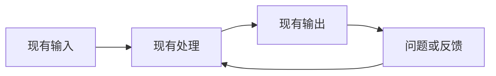
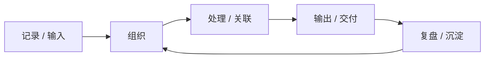
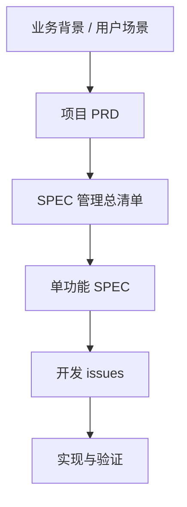
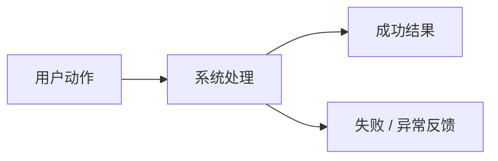
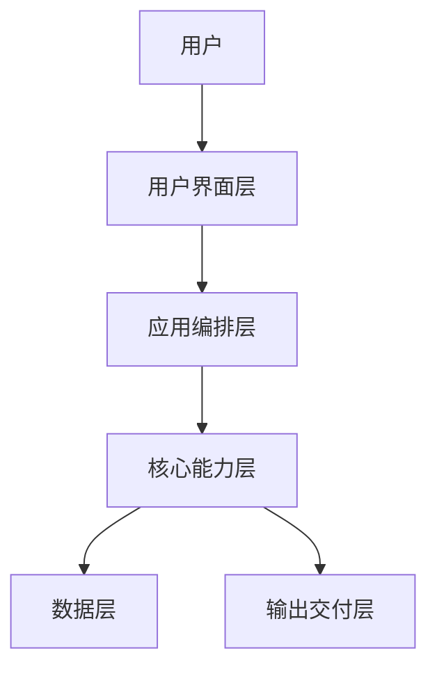
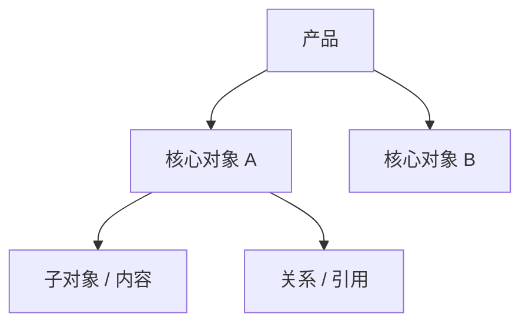
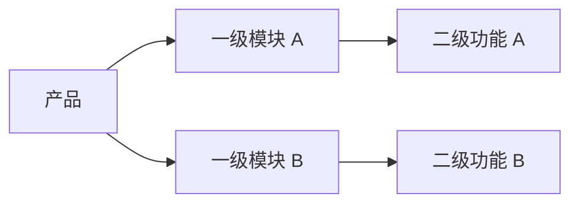

# <产品名称> 产品需求文档 PRD

> 文档元信息
> - 版本：v0.1 草稿
> - Owner：
> - 作者：
> - 最后更新：YYYY-MM-DD
> - 产品范围：
> - 文档定位：项目级 PRD，负责产品方向、业务流程、系统概述、功能范围、需求说明、里程碑和风险
> - 关联文档：

---

## 目录

1. [变更记录](#1-变更记录)
2. [背景介绍](#2-背景介绍)
3. [产品目标与定位](#3-产品目标与定位)
4. [目标用户与业务场景](#4-目标用户与业务场景)
5. [业务流程与需求流程](#5-业务流程与需求流程)
6. [系统概述与功能清单](#6-系统概述与功能清单)
7. [SPEC 管理总清单](#7-spec-管理总清单)
8. [需求说明](#8-需求说明)
9. [非功能需求](#9-非功能需求)
10. [验收标准总览](#10-验收标准总览)
11. [里程碑与版本规划](#11-里程碑与版本规划)
12. [风险与待确认问题](#12-风险与待确认问题)
13. [附录](#13-附录)

---

## 1. 变更记录

| 版本 | 作者 | 修订内容 | 发布日期 |
|---|---|---|---|
| v0.1 |  | 初稿 |  |

---

## 2. 背景介绍

### 2.1 业务背景

说明产品所处业务背景、用户当前工作方式、主要问题和为什么现在需要建设该产品。

### 2.2 一句话产品定义

> 用一句话说明产品面向谁、解决什么问题、提供什么核心价值。

### 2.3 业务收益

| 收益对象 | 收益说明 |
|---|---|
|  |  |

---

## 3. 产品目标与定位

### 3.1 产品定位

说明产品是什么，以及它与相近工具、系统或方案的区别。

### 3.2 不做什么

1.

### 3.3 阶段目标

| 阶段 | 目标 | 说明 |
|---|---|---|
| P0 |  |  |
| P1 |  |  |
| P2 |  |  |

### 3.4 成功指标

| 指标类型 | 指标名称 | 当前基线 | MVP 目标 | 度量方式 |
|---|---|---:|---:|---|
|  |  |  |  |  |

---

## 4. 目标用户与业务场景

### 4.1 目标用户

| 用户类型 | 日常任务 | 核心痛点 | 设备 / 环境 |
|---|---|---|---|
|  |  |  |  |

### 4.2 业务场景

| 场景 | 描述 |
|---|---|
|  |  |

---

## 5. 业务流程与需求流程

### 5.1 现有业务流程

用正文说明现有业务如何流转、断点在哪里、为什么需要产品承接。

### 5.2 目标业务流程

用正文说明产品希望把用户带到什么目标流程，以及关键体验变化是什么。

### 5.3 需求管理流程

说明 PRD、SPEC、issue 和验证之间的分层关系。

### 5.4 核心流程

核心流程必须同时包含正文说明和流程图。不要用一张总览图替代多个不同用户任务。

#### 5.4.1 <核心流程名称>

用一段正文说明用户意图、关键动作、系统处理和预期结果。

---

## 6. 系统概述与功能清单

### 6.1 系统架构图

说明系统如何承接业务流程。PRD 中的架构图描述产品能力边界，不替代工程设计文档。

### 6.2 信息结构图

说明系统管理的核心对象、层级和关系。

### 6.3 功能结构图

### 6.4 功能清单的含义

功能清单是产品范围索引，不替代需求说明。它用于说明有哪些模块和功能、优先级是什么，以及哪些功能需要继续拆成 SPEC。

### 6.5 功能清单

| 端 | 一级模块 | 二级功能 | 主要能力 | 优先级 | 说明 |
|---|---|---|---|---|---|
|  |  |  |  |  |  |

---

## 7. SPEC 管理总清单

### 7.1 SPEC 总清单的作用

SPEC 总清单用于让读者在 PRD 中看到哪些功能已有单功能规格、SPEC 位于哪里、当前状态是什么。

### 7.2 SPEC 总清单

| 模块 | 功能 / SPEC 主题 | 优先级 | SPEC 状态 | SPEC 路径 | 说明 |
|---|---|---|---|---|---|
|  |  |  | 待建 / draft / ready-for-implementation / implemented |  |  |

---

## 8. 需求说明

### 8.1 <模块名称>

用段落描述该模块服务的用户需求、主要能力、当前阶段边界和关键风险。不要把字段、按钮、提示文案、状态表全部写进 PRD；这些细节放入对应 SPEC。

---

## 9. 非功能需求

### 9.1 可用性

1.

### 9.2 性能

1.

### 9.3 可靠性

1.

### 9.4 数据安全

1.

### 9.5 可维护性

1.

---

## 10. 验收标准总览

### 10.1 产品级验收

1.

### 10.2 单功能验收要求

1.

---

## 11. 里程碑与版本规划

### 11.1 M1：<里程碑名称>

目标：

1.

交付：

1.

---

## 12. 风险与待确认问题

### 12.1 已识别风险

| 风险 | 可能性 | 影响 | 缓解措施 |
|---|---|---|---|
|  |  |  |  |

### 12.2 待确认问题

1. > ⚠️ 待确认：

---

## 13. 附录

### 13.1 参考文档

1.

### 13.2 术语表

| 术语 | 含义 |
|---|---|
| PRD | 项目级产品需求文档 |
| SPEC | 单功能需求规格说明书 |

### 13.3 质量自查

| 检查项 | 结果 |
|---|---|
| 业务流程与需求流程放在系统概述之前 | 待检查 |
| 系统概述包含系统架构图、信息结构图和功能结构图 | 待检查 |
| 核心流程包含正文说明和 Mermaid 流程图 | 待检查 |
| 功能清单只是范围索引，不替代需求说明 | 待检查 |
| PRD 内包含 SPEC 管理总清单 | 待检查 |
