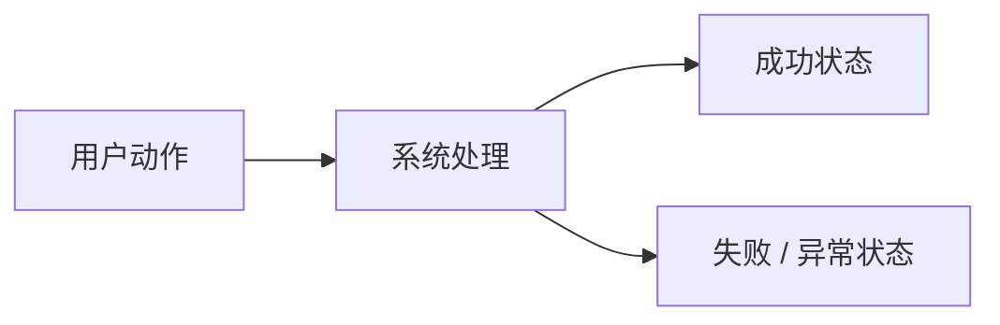
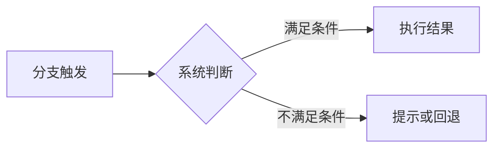

# <功能名称> 单功能需求规格说明书

> 文档元信息
> - 版本：v0.1 草稿
> - Owner：
> - 作者：
> - 最后更新：YYYY-MM-DD
> - 所属 PRD：`../PRD.md`
> - 功能路径：`<一级模块> / <二级功能>`
> - 状态：draft / review / ready-for-implementation / implemented

---

## 1. 功能概览

| 项目 | 内容 |
|---|---|
| 功能名称 |  |
| 优先级 | P0 / P1 / P2 |
| 功能使用者 |  |
| 入口位置 |  |
| 前置条件 |  |
| 相关模块 |  |
| 相关文件 |  |

## 2. 功能列表

| 序号 | 功能点 | 功能描述 | 优先级 |
|---:|---|---|---|
| 1 |  |  |  |

### 2.1 背景与目标

说明为什么要做这个功能、用户当前遇到的问题、功能要达成的产品目标，以及它和 PRD 中对应能力的关系。

### 2.2 方案取舍

当功能存在多个产品方案或交互路径时，在这里写清楚取舍。保留被放弃方案、采用方案和原因，避免把设计判断散落到临时对话或独立 design doc。

| 方案 | 内容 | 结论 | 原因 |
|---|---|---|---|
|  |  | 采用 / 不采用 / 后续 |  |

### 2.3 产品形态与范围边界

说明最终呈现给用户的功能形态、主要状态、P0/P1/P2 分层，以及本阶段明确不做什么。这里写产品设计和需求边界，不写文件级实施拆解。

## 3. 流程说明与流程图

本节必须同时包含正文说明和流程图。正文说明用户意图、关键动作、系统处理和预期结果；流程图展示步骤关系、分支和异常路径。不要只写一段箭头流程，也不要用一张总览图替代多个不同用户任务。

### 3.1 主流程：<流程名称>

用一段正文说明这个流程服务的用户目标、触发入口、关键系统处理、成功结果和失败反馈。

### 3.2 分支流程：<流程名称，可选>

如果该功能包含刷新、取消、关闭、重试、恢复、权限不足、数据为空等分支流程，应按流程分别补充正文和流程图。不适用时写“本功能无独立分支流程”。

## 4. 特殊业务

1.

## 5. 页面 / 状态说明

| 页面 / 状态 | 说明 | 可用操作 |
|---|---|---|
|  |  |  |

## 6. 查询条件

不适用时写“本功能无查询条件”。

| 字段 | 类型 | 内容 | 默认值 | 查询精度 | 查询规则 |
|---|---|---|---|---|---|
|  |  |  |  |  |  |

## 7. 列表字段 / 状态字段

不适用时写“本功能无列表字段”。

| 字段 | 内容 | 对齐 | 固定 | 排序 | 显示规则 |
|---|---|---|---|---|---|
|  |  |  |  |  |  |

## 8. 表单字段

不适用时写“本功能无表单字段”。

| 字段 | 类型 | 内容 | 默认值 | 格式规则 |
|---|---|---|---|---|
|  |  |  |  |  |

## 9. 交互说明

| 交互 | 说明 |
|---|---|
| 页面加载 |  |
| 提交 |  |
| 取消 / 关闭 |  |

## 10. 提示说明

| 场景 | 提示类型 | 提示文本 |
|---|---|---|
|  |  |  |

## 11. 异常处理

| 异常场景 | 系统处理 | 用户反馈 | 是否阻塞 |
|---|---|---|---|
|  |  |  |  |

## 12. 数据记录

| 数据项 | 来源 | 存储位置 | 用途 |
|---|---|---|---|
|  |  |  |  |

## 13. 权限与边界

1.

## 14. 验收标准

1.

## 15. 待确认问题

1. > ⚠️ 待确认：

## 16. 变更记录

| 版本 | 作者 | 修订内容 | 日期 |
|---|---|---|---|
| v0.1 |  | 初稿 |  |
