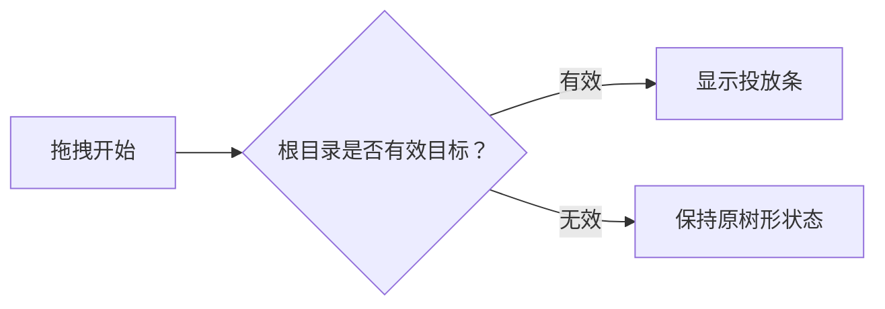
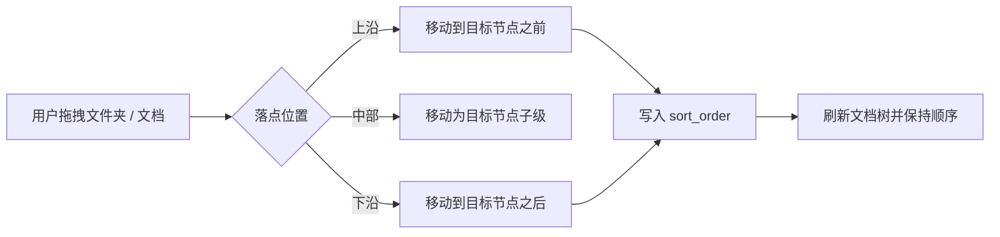

# 文档树单功能需求规格说明书

> 文档元信息
> - 版本：v0.2
> - Owner：Lusice
> - 作者：Codex
> - 最后更新：2026-05-22
> - 所属 PRD：`../PRD.md`
> - 功能路径：本地工作区 / 文档树
> - 状态：implemented

---

## 1. 功能概览

| 项目 | 内容 |
|---|---|
| 功能名称 | 左侧文档树与目录拖拽 |
| 优先级 | P0 |
| 功能使用者 | 个人工作空间用户 |
| 入口位置 | 左侧栏根目录、文件夹节点、文档节点 |
| 前置条件 | 用户已进入某个工作空间，左侧栏处于文档树视图 |
| 相关模块 | LeftSidebar、SidebarRootSection、SidebarTree、SidebarTreeItems、tree drag and drop |
| 相关文件 | `src/features/shell/LeftSidebar.tsx`、`src/features/shell/SidebarRootSection.tsx`、`src/features/shell/SidebarTreeItems.tsx`、`src/features/shell/sidebarTreeDnd.ts` |

## 2. 功能列表

| 序号 | 功能点 | 功能描述 | 优先级 |
|---:|---|---|---|
| 1 | 根目录投放条 | 拖拽子目录或子文档时，在根目录区域显示明确投放条，用户可松开拖回根目录 | P0.1 |
| 2 | 节点嵌套移动 | 拖拽文件夹或文档到另一个文件夹 / 文档节点时，将其移动为目标节点子级 | P0 |
| 3 | 手动排序 | 支持同级目录 / 文档按拖拽前后位置调整顺序 | P0.2 |

### 2.1 背景与目标

左侧文档树是用户管理知识结构的主入口。当前拖拽已经支持“移动到某个父级”，但用户在把子目录拖回根目录时缺少明确投放位置，容易误拖到某个根级文件夹中；同时，当前拖拽不支持调整同级顺序，无法满足用户对目录结构的精细整理需求。

P0.1 已解决“拖回根目录”的明确投放体验。P0.2 已补齐手动排序：同级文件夹和文档可通过拖拽到目标节点前后调整顺序，并持久化到本地 SQLite。

### 2.2 方案取舍

| 方案 | 内容 | 结论 | 原因 |
|---|---|---|---|
| 只扩大整个根目录区域 | 继续复用根目录容器作为 drop target | 不采用 | 命中范围仍不清晰，用户不知道是否会拖回根目录 |
| 增加显式根目录投放条 | 拖拽可回根目录的节点时，在根目录标题下显示“松开移到根目录” | P0.1 采用 | 改动小、风险低、用户意图明确 |
| 实现完整排序 | 增加排序字段和 reorder API，支持 before / after / inside | P0.2 采用 | 满足用户整理目录顺序的核心诉求，并通过 focused tests + Electron smoke 验证 |

### 2.3 产品形态与范围边界

P0.1 改善根目录投放体验，不改变现有“拖到节点中部即移动为子级”的语义。

P0.2 处理完整手动排序：同级目录 / 文档可拖到目标节点前后，并持久化顺序。节点中部仍表示嵌套移动，节点上沿 / 下沿表示 before / after 排序。

## 3. 流程说明与流程图

### 3.1 主流程：拖拽子节点回根目录

用户从某个子目录或子文档开始拖拽时，系统判断该节点是否可以移动到根目录。如果可以，根目录标题下方出现明确投放条。用户把节点拖到该投放条并松开后，系统调用现有移动逻辑，将文件夹 `parentId` 或文档 `folderId` 置为根级，并刷新树视图。

### 3.2 分支流程：拖拽无效节点

如果用户拖拽的节点已经在根目录，或拖拽目标会形成非法层级，系统不显示根目录投放条，也不触发移动。

### 3.3 主流程：拖拽调整同级顺序

用户拖拽文件夹或文档到目标节点上沿 / 下沿时，系统将该动作解释为排序，而不是嵌套移动。排序动作会调用文档树 reorder API，将被拖拽节点移动到目标节点前 / 后，并写入 `sort_order`。用户重新打开应用后，文档树应保持调整后的顺序。

## 4. 特殊业务

1. 文件夹不能移动到自身或后代节点下。
2. 文档不能移动到自身或后代节点下。
3. 根目录投放条只表达“移动到根目录”，不表达排序。
4. 拖拽到节点上沿 / 下沿表达排序；拖拽到节点中部表达嵌套移动。

## 5. 页面 / 状态说明

| 页面 / 状态 | 说明 | 可用操作 |
|---|---|---|
| 默认文档树 | 展示根目录、文件夹和文档层级 | 选择、展开、创建、重命名、删除、拖拽 |
| 拖拽中且可回根目录 | 根目录标题下显示投放条 | 松开移到根目录 |
| 拖拽中但不可回根目录 | 不显示根目录投放条 | 保持现有合法投放目标 |
| 拖拽到节点上沿 / 下沿 | 显示 before / after 投放指示 | 松开调整同级顺序 |

## 6. 查询条件

本功能无查询条件。

## 7. 列表字段 / 状态字段

| 字段 | 内容 | 对齐 | 固定 | 排序 | 显示规则 |
|---|---|---|---|---|---|
| 节点标题 | 文件夹名称或文档标题 | 左对齐 | 否 | P0.2 支持手动排序 | 超出宽度截断 |
| 根目录投放条 | “松开移到根目录” | 居中 | 否 | 不适用 | 仅有效拖拽期间显示 |

## 8. 表单字段

本功能无表单字段。

## 9. 交互说明

| 交互 | 说明 |
|---|---|
| 拖拽开始 | 记录被拖拽节点，判断根目录是否可作为目标 |
| 拖到根目录投放条 | 投放条高亮，drop effect 为 move |
| 松开 | 调用移动到根目录逻辑并刷新树 |
| 拖到节点上沿 / 下沿 | 显示排序位置指示，drop effect 为 move |
| 在节点上沿 / 下沿松开 | 调用 reorder API，将节点移动到目标前 / 后 |
| 拖拽结束 | 清理拖拽状态和高亮状态 |

## 10. 提示说明

| 场景 | 提示类型 | 提示文本 |
|---|---|---|
| 可拖回根目录 | 内联投放提示 | 松开移到根目录 |

## 11. 异常处理

| 异常场景 | 系统处理 | 用户反馈 | 是否阻塞 |
|---|---|---|---|
| 非法拖拽目标 | 不 prevent default，不触发 drop | 不显示根目录投放条或不高亮 | 是 |
| 移动 API 失败 | 保持原状态，由上层错误处理承接 | 当前版本无专门提示 | 是 |

## 12. 数据记录

| 数据项 | 来源 | 存储位置 | 用途 |
|---|---|---|---|
| folder.parentId | 拖拽移动 | SQLite folders.parent_id / mock state | 文件夹层级 |
| document.folderId | 拖拽移动 | SQLite documents.folder_id / mock state | 文档层级 |
| folder.sortOrder | 拖拽排序 | SQLite folders.sort_order / mock state | 文件夹排序 |
| document.sortOrder | 拖拽排序 | SQLite documents.sort_order / mock state | 文档排序 |
| 拖拽状态 | UI 事件 | React state | 控制投放条和高亮 |

## 13. 权限与边界

1. 仅允许在当前工作空间内移动。
2. P0.1 不处理跨空间移动，跨空间移动仍走现有菜单。
3. 不处理跨空间拖拽排序，跨空间移动仍走现有菜单。

## 14. 验收标准

1. 拖拽子文件夹时，根目录区域出现“松开移到根目录”投放条。
2. 在投放条松开子文件夹后，调用移动到根目录逻辑。
3. 现有拖拽到文件夹 / 文档节点的嵌套移动能力不回归。
4. 拖拽文件夹到同级目标节点下沿时，节点移动到目标节点之后。
5. 文件夹和文档混排顺序写入 SQLite，重新打开后仍按 `sort_order` 展示。
6. 左侧栏 focused tests、Electron persistence smoke 和 typecheck 通过。

## 15. 待确认问题

无。P0.2 已决策并实现：手动排序同时覆盖文件夹和文档，拖拽落点区分 before / after / inside。

## 16. 变更记录

| 版本 | 作者 | 修订内容 | 日期 |
|---|---|---|---|
| v0.1 | Codex | 新增文档树拖拽 P0.1 / P0.2 需求说明 | 2026-05-22 |
| v0.2 | Codex | 实现 P0.2 手动排序、排序持久化、before / after / inside 拖拽语义和验收标准 | 2026-05-22 |
