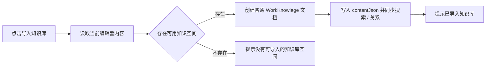

# 外部 Markdown 文件打开 单功能需求规格说明书

> 文档元信息
> - 版本：v0.1
> - Owner：Lusice
> - 作者：Codex
> - 最后更新：2026-05-20
> - 所属 PRD：`../PRD.md`
> - 功能路径：`文档编辑器 / 外部 Markdown 文件打开`
> - 状态：implemented

---

## 1. 功能概览

| 项目 | 内容 |
|---|---|
| 功能名称 | 外部 Markdown 文件打开 |
| 优先级 | P0 |
| 功能使用者 | 需要用 WorkKnowlage 临时编辑本地 `.md` / `.markdown` 文件的 macOS 用户 |
| 入口位置 | Finder 默认打开方式、双击 Markdown 文件、命令行启动参数、已运行应用的二次打开 |
| 前置条件 | 打包后的 macOS 应用已注册 Markdown 文件关联；文件路径可读写 |
| 相关模块 | Electron main / preload、React 外部文件窗口、BlockNote 编辑器、macOS 打包 |
| 相关文件 | `electron/externalFiles.cjs`、`electron/main.cjs`、`electron/preload.cjs`、`src/features/external-file/ExternalFileApp.tsx`、`package.json` |

## 2. 功能列表

| 序号 | 功能点 | 功能描述 | 优先级 |
|---:|---|---|---|
| 1 | Markdown 文件关联 | 打包应用注册 `.md` / `.markdown` 为可编辑文档类型 | P0 |
| 2 | 独立外部文件窗口 | 外部文件打开在单独 WorkKnowlage 窗口，不进入主知识库 shell | P0 |
| 3 | WorkKnowlage 块编辑 | 使用 WorkKnowlage BlockNote 编辑表面编辑外部 Markdown | P0 |
| 4 | 自动保存到原文件 | 编辑后 debounce 自动保存回原始 Markdown 路径 | P0 |
| 5 | 左侧目录 | 外部文件窗口保留文档目录，并放在最左侧 | P0 |
| 6 | 顶部状态与操作 | 顶部展示文件名、路径、自动保存状态、修改时间、字数、Finder 和导入按钮 | P0 |
| 7 | 导入知识库 | 用户主动点击后，将当前编辑内容创建为普通 WorkKnowlage 文档 | P0 |

### 2.1 背景与目标

用户希望把 WorkKnowlage 设置为 macOS Markdown 文件默认打开方式，并将外部 `.md` 文件作为“外部文件”编辑，而不是每次都先导入知识库。该能力的目标是让 WorkKnowlage 同时承担本地知识库和临时 Markdown 文件编辑器：外部文件默认写回原路径，只有用户明确点击“导入知识库”时才创建内部文档。

### 2.2 方案取舍

| 方案 | 内容 | 结论 | 原因 |
|---|---|---|---|
| 主窗口内弱化知识库选中态 | 在当前 AppShell 中显示外部文件，隐藏或弱化文档树选中态 | 不采用 | 容易让用户误解外部文件已经进入知识库，且会和右侧 Wiki / 属性上下文冲突 |
| 独立 WorkKnowlage 外部文件窗口 | 双击或默认打开 Markdown 时打开独立窗口，顶部显示外部文件状态，左侧保留目录 | 采用 | 清楚区分“外部文件”和“知识库文档”，同时复用 WorkKnowlage 编辑体验 |
| 纯 Markdown 源码编辑器 | 使用 textarea 或源码编辑器直接编辑 `.md` | 不采用 | 用户明确希望使用 WorkKnowlage 的块编辑体验 |

### 2.3 产品形态与范围边界

外部文件窗口由顶部状态栏、左侧目录和中央编辑器组成。顶部右侧放“在 Finder 中显示”和“导入知识库”；保存状态为自动保存，不提供主手动保存按钮。右侧 Wiki / 文档属性栏不出现在外部文件模式中。

本阶段只支持 `.md` / `.markdown`。Markdown 与 BlockNote 双向转换允许格式规范化；系统不承诺逐字符保留原始 Markdown 空行、列表编号和扩展语法。外部文件 autosave 会写回原路径，导入知识库不会删除或移动外部文件。

## 3. 流程说明与流程图

### 3.1 主流程：打开并编辑外部 Markdown

用户在 Finder 中双击 Markdown 文件或选择 WorkKnowlage 作为默认打开方式。系统识别路径后打开独立外部文件窗口，读取 Markdown，转换为 BlockNote 内容并展示目录、字数、修改时间和自动保存状态。用户编辑内容后，系统自动将当前块内容转换为 Markdown 并写回原文件。

### 3.2 分支流程：导入知识库

用户编辑外部文件时，可以点击“导入知识库”。系统将当前编辑器内容序列化为 WorkKnowlage 文档内容，在默认知识空间创建普通文档，并重建搜索与文档关系；外部 Markdown 文件保留在原路径。

## 4. 特殊业务

1. 外部文件窗口不能显示 Wiki / 右侧关联面板。
2. 外部文件不应在知识库目录树中出现选中态。
3. 应避免在首次 Markdown 解析和 BlockNote hydration 时立即写回原文件。
4. 同一路径重复打开时优先聚焦已有外部文件窗口。

## 5. 页面 / 状态说明

| 页面 / 状态 | 说明 | 可用操作 |
|---|---|---|
| 加载中 | 正在读取外部 Markdown 文件 | 无 |
| 正常编辑 | 顶部显示文件名、路径、自动保存状态、修改时间、字数；左侧显示目录 | 编辑、目录跳转、Finder、导入知识库 |
| 自动保存中 | 编辑后 debounce 保存回原文件 | 继续编辑、等待保存 |
| 保存失败 | 写回原文件失败 | 继续编辑，等待后续保存重试或处理文件权限 |
| 导入成功 | 已创建知识库文档 | 继续编辑外部文件 |

## 6. 查询条件

本功能无查询条件。

## 7. 列表字段 / 状态字段

| 字段 | 内容 | 对齐 | 固定 | 排序 | 显示规则 |
|---|---|---|---|---|---|
| 目录标题 | 当前外部文件中的 heading 块 | 左对齐 | 左侧栏 | 文档顺序 | 按 heading level 缩进 |

## 8. 表单字段

本功能无表单字段。

## 9. 交互说明

| 交互 | 说明 |
|---|---|
| 页面加载 | 读取外部文件，转换为 BlockNote 内容，派生目录和字数 |
| 自动保存 | 编辑器内容变化后 debounce 保存 Markdown，不展示手动保存主按钮 |
| 在 Finder 中显示 | 调用系统 Finder 定位当前外部文件 |
| 导入知识库 | 将当前编辑内容创建为普通 WorkKnowlage 文档 |
| 目录点击 | 滚动到对应 heading 块 |

## 10. 提示说明

| 场景 | 提示类型 | 提示文本 |
|---|---|---|
| 加载中 | 状态 | 正在打开外部文件... |
| 已保存 | 状态 | 已自动保存 |
| 保存中 | 状态 | 正在自动保存... |
| 保存失败 | 错误 | 自动保存失败 |
| 导入成功 | 反馈 | 已导入知识库 |
| 无可用空间 | 错误 | 没有可导入的知识库空间 |

## 11. 异常处理

| 异常场景 | 系统处理 | 用户反馈 | 是否阻塞 |
|---|---|---|---|
| 非 Markdown 路径 | 不作为外部文件打开 | 无或内部错误提示 | 是 |
| 文件读取失败 | 停留错误态 | 打开外部文件失败 | 是 |
| 文件写入失败 | 保留编辑器当前内容，状态置为错误 | 自动保存失败 | 否 |
| 没有知识空间 | 不创建内部文档 | 没有可导入的知识库空间 | 仅阻塞导入 |

## 12. 数据记录

| 数据项 | 来源 | 存储位置 | 用途 |
|---|---|---|---|
| 外部文件路径 | macOS open-file / argv / second-instance | 主进程窗口映射 | IPC 读写和 Finder 定位 |
| Markdown 内容 | 原始文件 | 原始 `.md` / `.markdown` 文件 | 外部编辑保存 |
| BlockNote 内容 | Markdown 转换 | Renderer 内存；导入时写入 SQLite | 编辑、目录、字数、导入 |
| 导入文档 | 用户点击导入 | SQLite documents 表 | 进入 WorkKnowlage 知识库 |

## 13. 权限与边界

1. 外部文件 autosave 需要原文件路径有写权限。
2. 外部文件不会自动进入知识库，必须由用户主动导入。
3. 导入知识库当前使用默认 / 第一个知识空间；后续可扩展为空间选择。
4. Markdown 规范化是当前版本可接受限制。

## 14. 验收标准

1. 打包后的 macOS 应用 Info.plist 包含 `.md` / `.markdown` 文档类型，角色为 Editor。
2. 双击或默认打开 Markdown 文件时，进入独立外部文件窗口。
3. 外部文件窗口顶部展示文件名、路径、自动保存状态、修改时间和字数。
4. 左侧目录展示 heading，并可点击跳转。
5. 右侧 Wiki / 文档属性栏不出现。
6. 编辑后自动保存回原 Markdown 文件。
7. 初始 Markdown 解析不应立即触发写回。
8. 点击“在 Finder 中显示”能定位原文件。
9. 点击“导入知识库”会创建普通知识库文档，原文件保持不变。

## 15. 待确认问题

1. 后续是否需要在导入时选择目标空间 / 文件夹。
2. 后续是否需要为外部文件提供“另存为”或“恢复到磁盘版本”。

## 16. 变更记录

| 版本 | 作者 | 修订内容 | 日期 |
|---|---|---|---|
| v0.1 | Codex | 初稿并按当前实现标记 implemented | 2026-05-20 |
