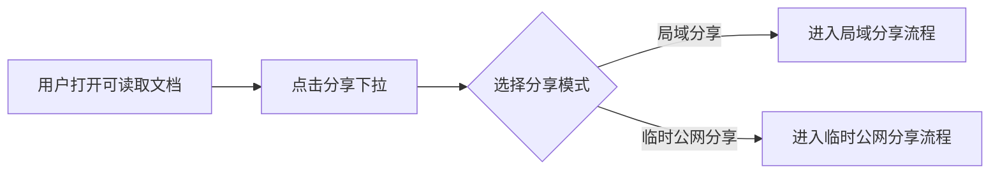
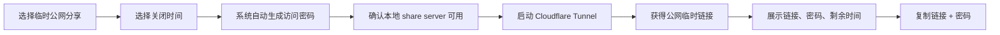
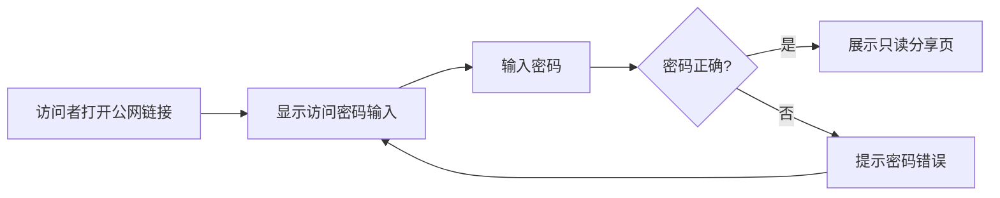
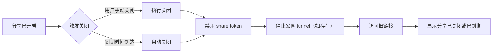

# 分享下拉与临时分享 单功能需求规格说明书

> 文档元信息
> - 版本：v0.4 implementation-aligned
> - Owner：Lusice
> - 作者：Codex based on Lusice context
> - 最后更新：2026-05-20
> - 所属 PRD：`../../PRD.md`
> - 功能路径：导出与分享 / 分享下拉 / 局域分享 / 临时公网分享
> - 状态：implemented-pending-runtime-verification
> - 外部能力参考：Cloudflare Tunnel Quick Tunnel
> - 2026-05-21 补充：分享启动中状态、共享链接视图、当前会话内重复复制公网密码、重置公网链接和一键关闭所有链接

---

## 1. 功能概览

| 项目 | 内容 |
|---|---|
| 功能名称 | 分享下拉与临时分享 |
| 优先级 | P0 |
| 功能使用者 | WorkKnowlage 桌面端用户 |
| 入口位置 | 当前文档的导出 / 分享操作区中的分享下拉 |
| 前置条件 | 用户已打开一个可读取的文档 |
| 分享模式 | 局域分享、临时公网分享 |
| 相关模块 | Electron share server、share renderer、Cloudflare Tunnel runtime、document export/render pipeline |
| 相关文件 | `electron/share/server.cjs`、`electron/share/render.cjs`、`electron/share/cloudflareTunnel.cjs`、`electron/share/repository.cjs`、`src/app/useDocumentShare.ts`、分享相关 UI 组件、`scripts/prepare-cloudflared.mjs` |

## 2. 功能列表

### 2.1 背景与目标

WorkKnowlage 已有局域网只读分享能力，适合同一 Wi-Fi 或同一内网下的设备临时阅读。但用户也会遇到对方不在同一局域网、临时需要从手机蜂窝网络或远程电脑打开文档的场景。此时只提供 LAN IP 不够。

本功能将原分享入口升级为“分享下拉”，在同一个入口下保留局域分享，并新增临时公网分享。临时公网分享通过 Cloudflare Tunnel 将本地 share server 暴露为临时公网链接；由于公网链接具备更高风险，v1 必须内置系统自动生成的访问密码和关闭时间。

### 2.2 方案取舍

局域分享继续作为本地轻量模式，不强制密码，不依赖第三方网络转发。临时公网分享面向普通用户，不隐藏在高级设置里，但必须明确它会通过第三方 Cloudflare Tunnel 转发访问请求。

临时公网分享 v1 采用 Quick Tunnel 形态：优点是无需用户配置域名、账号或 DNS，适合一次性临时分享；限制是公网地址不适合承诺长期稳定，不应被设计成永久发布能力。长期稳定公网发布、固定域名、Cloudflare Access 或账号绑定应作为后续能力单独评审。

### 2.3 功能列表

| 序号 | 功能点 | 功能描述 | 优先级 |
|---:|---|---|---|
| 1 | 分享下拉 | 在当前文档分享入口中展示局域分享、临时公网分享两种模式 | P0 |
| 2 | 局域分享 | 启动本地只读分享服务，并为当前文档生成 LAN IP 链接 | P0 |
| 3 | 局域链接复制 | 将当前局域分享链接复制到剪贴板 | P0 |
| 4 | 局域地址刷新 | 重新获取当前机器可用 LAN IP 分享地址 | P0 |
| 5 | 局域分享关闭 | 停止当前局域分享，使链接不可继续访问 | P0 |
| 6 | 临时公网分享 | 启动 Cloudflare Tunnel，生成公网临时链接 | P0 |
| 7 | 自动访问密码 | 每次开启公网分享时由系统自动生成强密码 | P0 |
| 8 | 关闭时间 | 开启公网分享时设置有效期，到期自动关闭 | P0 |
| 9 | 链接与密码复制 | 支持一键复制公网链接和访问密码 | P0 |
| 10 | 公网密码门禁 | 公网分享页先校验密码，通过后展示只读文档 | P0 |
| 11 | 公网分享关闭 | 手动关闭或到期时禁用 share token，并停止 Cloudflare Tunnel | P0 |
| 12 | 分享状态展示 | 展示未开启、启动中、已开启、失败、已到期等状态 | P0 |
| 13 | 只读分享页 | 浏览器打开后只能阅读，不能编辑 | P0 |
| 14 | 分享页目录 | 长文档展示目录，辅助阅读定位 | P0 |
| 15 | 分享页响应式布局 | 桌面宽屏和移动端都保持可读 | P0 |
| 16 | 共享链接视图 | 在左侧快捷入口进入当前空间所有活跃分享列表 | P0 |
| 17 | 单链接管理 | 每个局域 / 公网链接支持复制、关闭；公网链接支持重置链接和密码 | P0 |
| 18 | 一键关闭所有链接 | 当前空间所有活跃局域和公网分享可一次关闭 | P0 |
| 19 | 当前会话密码复制 | 公网密码只在创建或重置时明文返回，当前 App 会话内可重复复制链接和密码 | P0 |

## 3. 流程说明与流程图

分享的核心流程是“用户从当前文档的分享下拉中选择一种临时只读交付方式”。局域分享适合同一局域网，临时公网分享适合非同网段场景。两种模式都必须保证关闭后旧链接失效；公网分享还必须保证密码校验和到期自动关闭。

### 3.1 主流程：选择分享模式

用户打开一个可读取的文档后，点击分享下拉。系统展示两个明确选项：局域分享、临时公网分享。用户选择局域分享时走 LAN IP 流程；选择临时公网分享时走 Cloudflare Tunnel 流程。

### 3.2 分支流程：局域分享

局域分享保留现有能力。系统启动 share server，并确保服务监听非 loopback 地址；随后系统选择当前机器可用的 LAN IP，生成分享链接并展示给用户。用户复制链接后，同一局域网内的其他设备可以通过浏览器访问只读分享页。

### 3.3 分支流程：临时公网分享

临时公网分享在本地 share server 之上启动 Cloudflare Tunnel。系统先确认或启动本地 share server，再自动生成访问密码，并让用户选择关闭时间。随后系统启动 tunnel，将 `localhost` share server 暴露为公网临时 URL。成功后展示公网链接、访问密码和剩余有效期。

### 3.4 分支流程：公网访问密码校验

访问者打开公网链接后，不应直接看到文档内容。分享页先展示密码输入界面；密码正确时进入只读文档页，密码错误时提示重新输入。密码由系统生成，用户创建分享时不需要手动填写。

### 3.5 分支流程：关闭、到期与失效访问

局域分享和临时公网分享都支持手动关闭。临时公网分享还支持到期自动关闭。关闭或到期后，系统必须禁用 share token；如果存在 Cloudflare Tunnel 进程，还必须停止该进程。其他设备再次访问旧链接时，应看到失效或不可访问提示。

## 4. 特殊业务

1. 分享下拉必须同时提供局域分享和临时公网分享，不能用公网分享替代局域分享。
2. 局域分享链接不能只显示 `127.0.0.1`，否则其他设备无法访问。
3. 局域分享的 share server 不能只监听 loopback 地址，必须监听非 loopback 地址，例如 `0.0.0.0`。
4. 临时公网分享通过 Cloudflare Tunnel 暴露本地只读分享页，属于第三方网络转发能力。
5. 临时公网分享 v1 必须内置访问密码，不能只依赖 URL token。
6. 访问密码由系统每次自动生成，不要求用户创建时手动输入。
7. 临时公网分享必须设置关闭时间，默认建议 1 小时，并提供 30 分钟、1 小时、今天内、手动关闭等选项。
8. “手动关闭”不代表永久发布；它仍然是临时公网分享，只是由用户负责关闭。
9. 重新生成公网分享时，应重新生成公网链接和访问密码。
10. 关闭或到期后，旧局域链接和旧公网链接都不可继续访问。
11. 分享页必须只读，不提供编辑入口。
12. 分享页宽屏布局要让正文和目录形成 centered reading group，不能让目录像孤岛一样挂在右侧。
13. 不能只放大白色内容卡片来假修复布局；需要同时检查正文宽度、目录宽度、grid gap 和整体居中。
14. 长中文标题、长目录、富表格、提醒块和列表都应保持可读。
15. macOS 打包必须把 `cloudflared` 二进制内置到 app resources 的 `bin/cloudflared`，运行时优先使用内置二进制，再 fallback 到 `CLOUDFLARED_PATH` 或系统 `PATH`。
16. 用户点击分享操作后，不能只表现为按钮置灰；文档标题下的分享状态胶囊必须显示“正在开启 / 正在生成公网链接 / 正在关闭”等中间态，并带有加载反馈。
17. 公网访问密码不应长期明文持久化。数据库只保存密码哈希；当前 App 会话可临时记住最近创建或重置的公网密码，用于重复复制“公网链接 + 密码”。
18. 如果 App 重启或当前会话没有记住密码，系统仍应允许复制公网链接，并通过“重置公网链接和密码”生成新 public token 和新密码。
19. “共享链接”左侧入口应展示当前空间全部活跃分享，区分局域分享和临时公网分享，并支持复制、关闭、重置和一键关闭。

## 5. 页面 / 状态说明

| 页面 / 状态 | 说明 | 可用操作 |
|---|---|---|
| 未开启 | 当前文档没有分享链接 | 打开分享下拉 |
| 分享下拉 | 展示局域分享、临时公网分享 | 选择模式 |
| 局域分享启动中 | 系统正在启动服务和生成 LAN IP 链接 | 禁用重复开启，可取消或等待 |
| 局域分享已开启 | 当前文档已生成 LAN IP 分享链接 | 复制链接、刷新地址、关闭分享 |
| 局域分享启动失败 | share server 启动失败或 LAN 地址不可用 | 重试、查看错误 |
| 公网分享配置中 | 用户选择关闭时间，系统准备生成密码和公网链接 | 选择有效期、取消 |
| 公网 tunnel 启动中 | 系统正在启动 Cloudflare Tunnel | 禁用重复开启，可取消或等待 |
| 公网分享已开启 | 当前文档已生成公网链接、访问密码和有效期 | 复制链接 + 密码、查看剩余时间、关闭分享 |
| 共享链接列表 | 当前空间存在一个或多个活跃分享 | 复制链接、关闭单个分享、重置公网链接和密码、一键关闭所有链接 |
| 共享链接空状态 | 当前空间没有活跃分享 | 查看空状态说明，返回文档分享入口 |
| 公网分享启动失败 | tunnel 启动失败、网络不可用或外部依赖异常 | 重试、切换局域分享、查看错误 |
| 分享已关闭 | 用户主动关闭分享 | 重新开启 |
| 分享已到期 | 公网分享超过关闭时间后自动关闭 | 重新开启 |
| 分享页密码输入 | 公网访问者输入访问密码 | 提交密码 |
| 分享页只读访问 | 浏览器展示文档内容和目录 | 阅读、滚动、点击目录 |
| 分享失效访问 | 分享关闭或到期后访问旧链接 | 显示失效提示 |

## 6. 查询条件

本功能无查询条件。

## 7. 列表字段 / 状态字段

| 字段 | 内容 | 对齐 | 固定 | 排序 | 显示规则 |
|---|---|---|---|---|---|
| 分享模式 | 局域分享 / 临时公网分享 | 居中 | 否 | 否 | 在分享下拉中清晰区分 |
| 分享状态 | 未开启 / 启动中 / 已开启 / 失败 / 已关闭 / 已到期 | 居中 | 否 | 否 | 用文案和视觉状态清晰表达 |
| 局域分享地址 | LAN IP URL | 靠左 | 否 | 否 | 地址过长时中间省略，hover 或点击可查看完整 |
| 公网分享地址 | Cloudflare Tunnel 临时 URL | 靠左 | 否 | 否 | 地址过长时中间省略，支持复制完整链接 |
| 访问密码 | 系统自动生成的公网分享密码 | 靠左 | 否 | 否 | 默认可见或可一键复制；不在文档内容中展示 |
| 关闭时间 | 公网分享到期时间或手动关闭 | 靠左 | 否 | 否 | 已开启状态展示剩余时间或到期时间 |
| 文档标题 | 当前分享文档标题 | 靠左 | 否 | 否 | 长标题换行，不挤压操作按钮 |
| 错误原因 | 启动失败、端口占用、无 LAN IP、tunnel 失败等 | 靠左 | 否 | 否 | 只在失败状态展示 |
| 当前空间分享数 | 局域分享数量、公网分享数量、分享文档数量 | 靠左 | 否 | 否 | 在共享链接视图顶部展示 |

## 8. 表单字段

| 字段 | 类型 | 必填 | 默认值 | 说明 |
|---|---|---|---|---|
| 公网分享关闭时间 | 分段选择 | 是 | 1 小时 | 选项建议：30 分钟、1 小时、今天内、手动关闭 |

公网分享 v1 不提供用户手动输入密码字段。密码由系统自动生成，并在创建成功后展示和复制。

## 9. 交互说明

| 交互 | 说明 |
|---|---|
| 打开分享下拉 | 展示局域分享和临时公网分享两个入口 |
| 开启局域分享 | 启动服务并生成 LAN IP 链接；成功后进入“局域分享已开启”状态 |
| 复制局域链接 | 将当前完整 LAN URL 写入剪贴板，并给出成功提示 |
| 刷新局域地址 | 重新获取本机 LAN IP；如果 IP 变化，更新展示链接 |
| 关闭局域分享 | 停止当前文档分享；成功后旧链接失效 |
| 开启临时公网分享 | 选择关闭时间，自动生成密码，启动 Cloudflare Tunnel，成功后展示公网链接 |
| 复制公网链接 + 密码 | 将公网 URL 和访问密码写入剪贴板，并给出成功提示 |
| 再次复制公网链接 + 密码 | 当前 App 会话记住密码时，允许重复复制 URL 和密码 |
| 复制公网链接 | 当前 App 会话没有明文密码时，允许复制公网 URL |
| 重置公网链接和密码 | 重新生成公网 token 和访问密码，旧公网链接失效；成功后复制新 URL 和新密码 |
| 关闭临时公网分享 | 禁用 share token，停止 tunnel，成功后旧公网链接失效 |
| 打开共享链接视图 | 左侧点击“共享链接”，中央显示当前空间所有活跃局域 / 公网分享 |
| 关闭单个共享链接 | 在共享链接视图中关闭指定文档的局域或公网分享 |
| 一键关闭所有链接 | 在共享链接视图中关闭当前空间所有活跃分享 |
| 到期自动关闭 | 到达关闭时间后自动关闭公网分享并停止 tunnel |
| 访问公网分享页 | 先展示密码输入；密码正确后展示只读文档 |
| 分享失效 | 分享关闭或到期后访问旧 URL，展示失效或不可访问提示 |

## 10. 提示说明

| 场景 | 提示类型 | 提示文本 |
|---|---|---|
| 局域分享开启成功 | 全局提示 / 控件状态 | 局域分享已开启 |
| 局域链接复制成功 | 全局提示 | 局域分享链接已复制 |
| 局域地址刷新成功 | 控件状态 | 局域分享地址已刷新 |
| 公网分享开启成功 | 全局提示 / 控件状态 | 临时公网分享已开启 |
| 公网链接和密码复制成功 | 全局提示 | 公网链接和访问密码已复制 |
| 分享关闭成功 | 全局提示 / 控件状态 | 分享已关闭 |
| 公网分享到期 | 控件状态 | 临时公网分享已到期 |
| 端口占用 | 错误提示 | 分享服务启动失败，端口可能被占用 |
| 无 LAN IP | 错误提示 | 未找到可用于局域网访问的地址，请检查网络连接 |
| Cloudflare Tunnel 启动失败 | 错误提示 | 临时公网分享启动失败，请检查网络连接或稍后重试 |
| 密码错误 | 分享页提示 | 访问密码不正确 |
| 分享失效 | 分享页提示 | 当前分享已关闭或已到期 |

## 11. 异常处理

| 异常场景 | 系统处理 | 用户反馈 | 是否阻塞 |
|---|---|---|---|
| share server 启动失败 | 停止启动流程，保留文档状态 | 显示启动失败原因 | 是 |
| 端口被占用 | 尝试可用端口或提示失败 | 显示端口占用相关提示 | 是 |
| 无可用 LAN IP | 不生成误导性的 `127.0.0.1` 对外链接 | 提示检查网络或刷新地址 | 是 |
| Cloudflare Tunnel 启动失败 | 停止公网分享创建，不暴露半成品公网状态 | 提示 tunnel 启动失败，并保留切换局域分享入口 | 是 |
| 公网链接生成后 tunnel 断开 | 标记公网分享异常，并建议关闭或重试 | 展示公网分享不可用状态 | 是 |
| 公网分享到期 | 自动禁用 share token 并停止 tunnel | 展示已到期状态 | 是 |
| 密码错误 | 不展示文档内容 | 提示密码错误 | 是 |
| 文档内容渲染失败 | 尽量保留纯文本可读内容 | 分享页显示部分内容和错误说明 | 部分阻塞 |
| 分享关闭后访问 | 返回失效状态 | 显示分享已关闭或已到期 | 是 |
| 分享页布局异常 | 不影响服务，但需要记录为视觉缺陷 | 无用户错误提示，研发侧修复 | 否 |

## 12. 数据记录

| 数据项 | 来源 | 存储位置 | 用途 |
|---|---|---|---|
| 分享文档 ID | 当前文档 | app/share state 或持久化 share record | 确认分享对象 |
| 分享模式 | 用户选择 | app/share state 或持久化 share record | 区分局域分享和公网分享 |
| 分享状态 | 用户操作 / server 回执 / tunnel 回执 | app/share state | UI 状态展示 |
| 局域分享 URL | server 生成 | app/share state | 展示与复制 |
| 公网分享 URL | Cloudflare Tunnel 回执 | app/share state | 展示与复制 |
| 访问密码 | 系统生成 | 仅创建成功时短暂返回给 UI；数据库保存 hash / salt | 公网分享访问校验与复制给用户 |
| 关闭时间 | 用户选择 / 系统计算 | share record | 到期自动关闭 |
| LAN IP | 本机网络信息 | runtime state | 生成局域访问链接 |
| 端口 | server 配置 | runtime state | 生成 URL |
| tunnel 进程状态 | tunnel runtime | runtime state | 公网分享可用性和关闭 |
| 开启 / 关闭时间 | 用户操作 | 可选记录 | 诊断和审计 |
| 错误原因 | server / tunnel / renderer | app error state | 用户提示与调试 |

## 13. 权限与边界

1. 分享页只读，不提供编辑权限。
2. 局域分享面向同一局域网临时阅读，不依赖公网转发。
3. 临时公网分享通过 Cloudflare Tunnel 提供公网临时访问，属于第三方网络转发能力。
4. 临时公网分享 v1 必须有系统自动生成的访问密码。
5. 临时公网分享必须设置关闭时间，不能被设计成永久发布入口。
6. 拿到公网链接和密码的人可以访问分享页；WorkKnowlage v1 不提供账号级访问控制。
7. 当前版本不提供访问日志、访问次数统计、Cloudflare 账号绑定、固定域名和 Cloudflare Access。
8. 后续如增加固定域名、团队权限、访问日志或 Cloudflare Access，需要单独 SPEC 评审。

## 14. 验收标准

1. 分享入口是下拉结构，并同时提供局域分享和临时公网分享。
2. 局域分享保留现有 LAN IP 能力，不被公网分享替代。
3. 开启局域分享后，分享链接使用 LAN IP，而不是仅使用 `127.0.0.1`。
4. share server 监听非 loopback 地址，同一局域网内其他设备可以访问。
5. 开启临时公网分享时，系统要求选择关闭时间。
6. 开启临时公网分享时，系统自动生成访问密码，不要求用户手动输入。
7. 临时公网分享成功后，用户可以复制公网链接和访问密码。
8. 公网分享页必须先校验访问密码，密码错误时不展示文档内容。
9. 手动关闭或到期后，旧局域链接和旧公网链接不可继续访问。
10. 公网分享关闭或到期后，应停止对应 Cloudflare Tunnel 进程。
11. Cloudflare Tunnel 启动失败时，系统展示明确错误，并保留局域分享可用路径。
12. 分享页能展示标题、时间、正文、提醒块、列表、表格和目录。
13. 长中文标题不会挤压布局或溢出。
14. 宽屏下正文和目录作为整体阅读组居中，不出现明显视觉偏斜。
15. 分享控件不拆成多个冗余按钮，状态和主操作清晰可读。
16. 启动失败、端口占用、无 LAN IP、tunnel 失败、密码错误时有明确提示。
17. 相关渲染、分享服务、密码校验、到期关闭或 tunnel runtime 改动有 focused tests 或 browser smoke 验证。
18. macOS 打包前会准备 `cloudflared`，并在应用资源目录中内置可执行文件；若下载或内置失败，临时公网分享必须给出明确失败提示，不影响局域分享。

## 15. 待确认问题

1. > ⚠️ 待确认：后续是否需要访问日志或访问次数统计？
2. > ⚠️ 待确认：公网分享密码错误是否需要错误次数限制或短暂锁定？
3. > ⚠️ 待确认：后续是否需要支持 Cloudflare 账号、Named Tunnel、固定域名或 Cloudflare Access？
4. > ⚠️ 待确认：移动端分享页是否需要单独的目录折叠样式？
5. > ⚠️ 待确认：是否允许用户手动选择端口？

## 16. 变更记录

| 版本 | 作者 | 修订内容 | 日期 |
|---|---|---|---|
| v0.1 | Codex | 初稿，按单功能规格模板整理本地分享需求 | 2026-05-13 |
| v0.2 | Codex | 将第 3 章升级为正文说明 + Mermaid 流程图，并拆分主流程、刷新地址、关闭分享分支 | 2026-05-13 |
| v0.3 | Codex | 将分享能力升级为分享下拉：保留局域分享，新增 Cloudflare Tunnel 临时公网分享，并明确公网分享自动密码、关闭时间和失效边界 | 2026-05-20 |
| v0.4 | Codex | 对齐实现：补充 public share token / password hash、Cloudflare Tunnel runtime、分享下拉入口、IPC/hook 和 macOS 内置 `cloudflared` 打包约束 | 2026-05-20 |
