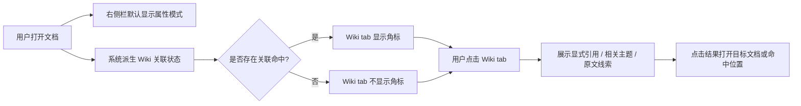
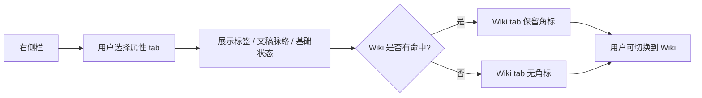
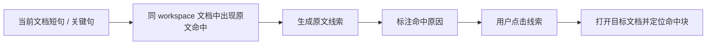
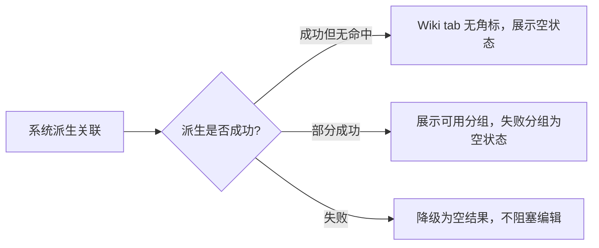

# 右侧栏上下文面板与 Wiki 关联 单功能需求规格说明书

> 文档元信息
> - 版本：v0.2 草稿
> - Owner：Lusice
> - 作者：Codex based on Lusice context
> - 最后更新：2026-05-15
> - 所属 PRD：`../PRD.md`
> - 功能路径：关系导航 / 右侧栏上下文面板与 Wiki 关联
> - 状态：draft

---

## 1. 功能概览

| 项目 | 内容 |
|---|---|
| 功能名称 | 右侧栏上下文面板与 Wiki 关联 |
| 优先级 | P0 |
| 功能使用者 | WorkKnowlage 桌面端用户 |
| 入口位置 | 编辑器右侧栏 |
| 前置条件 | 用户已打开一个文档；应用已加载当前 workspace 的文档、文件夹、标签、引用和内容快照 |
| 相关模块 | App-level association orchestration、RightSidebar、document mentions、workspace documents、block navigation |
| 相关文件 | `src/app/useSidebarAssociations.ts`、`src/shared/lib/sidebarAssociations.ts`、`src/features/shell/RightSidebar.tsx`、`src/shared/lib/outgoingMentions.ts` |

## 2. 功能列表

| 序号 | 功能点 | 功能描述 | 优先级 |
|---:|---|---|---|
| 1 | 属性 / Wiki tab | 右侧栏提供属性与 Wiki 两种查看模式，区分文档自身状态和知识库关系 | P0 |
| 2 | 属性模式 | 展示当前文档标签、文稿脉络和基础状态 | P0 |
| 3 | Wiki 命中角标 | 当 Wiki 模式存在可查看命中时，在 Wiki tab 上显示角标 | P0 |
| 4 | 显式引用 | 展示当前文档的出链、反向链接和文档提及 | P0 |
| 5 | 相关主题 | 展示真正偏 wiki 语义的相关文档或相关主题结果 | P0 |
| 6 | 原文线索 | 展示短句原文、标题式短语、关键句命中的证据结果 | P0 |
| 7 | 关联打开与定位 | 点击引用、相关主题或原文线索后打开目标文档，能定位到块时定位到块 | P0 |
| 8 | 空状态 | 属性、显式引用、相关主题、原文线索分别有独立空状态 | P0 |
| 9 | 派生数据缓存 | 关联结果由 app-level hook 准备和缓存，RightSidebar 不在 render flow 中做昂贵派生 | P0 |

## 3. 流程说明与流程图

右侧栏上下文面板服务两个不同用户目标：一是查看当前文档本身的属性和结构；二是查看当前文档与知识库中其他文档的关系。属性模式不能被关联结果挤占，Wiki 模式也不能退化成普通搜索结果。系统应通过 tab 区分这两类任务，并通过 Wiki tab 角标提醒用户当前文档存在可查看的关系线索。

### 3.1 主流程：查看 Wiki 关联

用户打开一个文档后，右侧栏默认展示属性模式。系统在后台根据当前文档、同 workspace 文档、文件夹、显式引用和内容块派生 Wiki 关联状态。如果存在显式引用、相关主题或原文线索，Wiki tab 显示角标。用户点击 Wiki tab 后，系统展示分层关系：显式引用优先，其次是相关主题，最后是原文线索。用户点击任一结果后，应用打开对应文档；如果结果带有 blockId 或 fallbackText，则尽量定位到命中块。

### 3.2 分支流程：属性模式查看与返回

用户需要查看当前文档本身时，停留在属性 tab。属性模式展示标签、目录和基础状态，不展示大量关联结果。即使用户在属性模式下，Wiki tab 角标仍应保留，让用户知道当前文档存在知识关联。用户可以随时切回 Wiki，也可以从 Wiki 切回属性，切换不应丢失当前文档选择和编辑状态。

### 3.3 分支流程：原文线索命中

当当前文档包含短句、标题式短语或关键句时，系统不应直接把这些命中提升为相关主题。系统应把它们放入原文线索层，用“命中关键句”“命中短语”等原因说明它们是证据，而不是语义相似本身。用户点击线索后打开目标文档并定位到命中块，形成可追溯路径。

### 3.4 分支流程：无关联或数据异常

当当前文档没有可用关联时，Wiki tab 不显示角标，Wiki 模式内分别展示空状态。关联派生失败或内容无法解析时，不应影响文档编辑；系统应降级为空结果或局部结果，并避免在右侧栏显示误导性推荐。

## 4. 特殊业务

1. 右侧栏不是单纯文档属性面板，应同时支持文档属性和 Wiki 关联两种任务。
2. Wiki 关联不等同于搜索结果列表。短句原文命中、标题式短语命中和关键句命中应归入原文线索，不应直接冒充语义相似。
3. 相关主题应保持少而准，服务 wiki 式知识发现。
4. 显式引用来自用户内容和真实文档提及，优先级高于派生关联。
5. Wiki tab 角标用于提示“有可查看的关联命中”，不是搜索命中总量的完整统计。
6. 关联结果只在当前 workspace 内派生，不跨 workspace 混合展示。
7. RightSidebar 只消费 prepared association state，不在 React render flow 中做昂贵派生。
8. 原文线索需要可点击回到目标文档和命中位置，否则证据价值不足。

## 5. 页面 / 状态说明

| 页面 / 状态 | 说明 | 可用操作 |
|---|---|---|
| 右侧栏 - 属性 tab | 默认查看当前文档自身状态 | 查看标签、添加标签、删除标签、查看目录、点击目录定位 |
| 右侧栏 - Wiki tab | 查看当前文档与知识库关系 | 查看显式引用、相关主题、原文线索，点击打开目标 |
| Wiki tab 有角标 | 存在显式引用、相关主题或原文线索 | 点击 Wiki tab 查看详情 |
| Wiki tab 无角标 | 当前无可查看关联命中 | 点击 Wiki tab 查看空状态 |
| 显式引用有结果 | 当前文档存在出链或反链 | 点击打开来源或目标文档 |
| 相关主题有结果 | 当前文档存在语义相关文档 | 点击打开相关文档，hover 可查看摘要 |
| 原文线索有结果 | 当前文档存在短句、标题式短语或关键句命中 | 点击打开目标文档并定位命中块 |
| 关联派生失败 | 关联数据无法完整生成 | 编辑不受阻塞，展示空结果或局部结果 |

## 6. 查询条件

本功能无用户输入查询条件。关联数据由当前文档和当前 workspace 内容自动派生。

| 字段 | 类型 | 内容 | 默认值 | 查询精度 | 查询规则 |
|---|---|---|---|---|---|
| 当前文档 | 系统上下文 | activeDocument | 当前选中文档 | 精确 | 只基于当前打开文档派生 |
| 当前 workspace | 系统上下文 | activeDocument.spaceId | 当前空间 | 精确 | 只匹配同 workspace 文档 |
| 当前大纲焦点 | 系统上下文 | focusedOutlineItemId | null | 精确 | 用于局部相似块或后续聚焦关联 |

## 7. 列表字段 / 状态字段

| 字段 | 内容 | 对齐 | 固定 | 排序 | 显示规则 |
|---|---|---|---|---|---|
| Tab 名称 | 属性 / Wiki | 居中 | 是 | 否 | 始终展示 |
| Wiki 角标 | 关联命中聚合数量 | 居中 | 否 | 否 | 数量大于 0 时展示；为 0 时隐藏；超过 9 时显示 `9+` |
| 显式引用标题 | 来源或目标文档标题 | 靠左 | 否 | 可按更新时间或关系顺序 | 长标题截断或换行，不能挤压图标 |
| 相关主题标题 | 相关文档标题 | 靠左 | 否 | 按相关度排序 | 可附简短原因或匹配数 |
| 原文线索标题 | 命中文档标题 | 靠左 | 否 | 按证据强度排序 | 需要展示命中原因和关键文本 |
| 命中原因 | 命中关键句 / 命中短语 / 命中标题式表达 | 靠左 | 否 | 否 | 作为证据说明，不替代标题 |
| 命中片段 | 原文附近文本 | 靠左 | 否 | 否 | 长文本截断，hover 或点击可看更多 |

## 8. 表单字段

属性 tab 中保留当前标签添加输入。

| 字段 | 类型 | 内容 | 默认值 | 格式规则 |
|---|---|---|---|---|
| 标签输入 | 文本输入 | 用户要添加到当前文档的标签 | 空 | 为空时不提交；未输入 `#` 时系统可自动补齐 |

## 9. 交互说明

| 交互 | 说明 |
|---|---|
| 页面加载 | 右侧栏默认展示属性 tab，并触发或读取 prepared association state |
| 点击属性 tab | 展示标签、文稿脉络和基础状态 |
| 点击 Wiki tab | 展示显式引用、相关主题和原文线索 |
| Wiki 角标展示 | 当聚合命中数量大于 0 时展示；超过 9 时显示 `9+`；不需要用户展开 Wiki 才能看到 |
| 点击显式引用 | 打开来源或目标文档；有 blockId 时定位到块 |
| 点击相关主题 | 打开相关文档；后续可支持打开最佳匹配块 |
| hover 相关主题 | 可展示相关片段预览，不能遮挡主编辑区关键内容 |
| 点击原文线索 | 打开目标文档并定位到命中块；必要时使用 fallbackText 辅助定位 |
| 切换文档 | 清理当前 tab 内 hover 状态，重新读取新文档关联状态 |
| 添加标签 | 仍在属性 tab 内完成，不进入 Wiki tab |

## 10. 提示说明

| 场景 | 提示类型 | 提示文本 |
|---|---|---|
| 属性无标签 | 空状态 | 暂无标签 |
| 属性无大纲 | 空状态 | 暂无大纲内容 |
| Wiki 无显式引用 | 空状态 | 当前文稿还没有引用或提及 |
| Wiki 无相关主题 | 空状态 | 暂未发现相关主题 |
| Wiki 无原文线索 | 空状态 | 暂未发现原文线索 |
| 未选择文档 | 空状态 | 请选择文稿以查看知识关联 |
| 原文线索原因 | 行内说明 | 命中关键句 / 命中短语 / 命中标题式表达 |

## 11. 异常处理

| 异常场景 | 系统处理 | 用户反馈 | 是否阻塞 |
|---|---|---|---|
| 当前文档为空 | 返回空 association state | 显示未选择或空状态 | 否 |
| contentJson 解析失败 | 跳过异常文档或降级为空候选 | 不显示错误推荐 | 否 |
| 目标文档已删除 | 不展示或禁用该关联结果 | 结果不可点击或不出现 | 否 |
| 目标块不存在 | 打开目标文档，使用 fallbackText 尝试定位 | 不弹错误，保持文档可读 | 否 |
| 关联派生耗时 | 使用缓存或异步更新 | 保持当前 UI，更新后刷新角标 | 否 |
| 命中数量过多 | 原文线索限制数量并排序 | 角标显示聚合数量或上限 | 否 |

## 12. 数据记录

| 数据项 | 来源 | 存储位置 | 用途 |
|---|---|---|---|
| activeDocument | workspace session | React state | 派生当前文档属性和 Wiki 关联 |
| documents | workspace snapshot | React state / SQLite repository | 同 workspace 关联候选 |
| folders | workspace snapshot | React state / SQLite repository | 显示路径和上下文 |
| outgoing mentions | contentJson 解析 | derived association state | 显式出链 |
| incoming backlinks | SQLite backlinks / document record | DocumentRecord.backlinks | 显式反链 |
| related topics | association derivation | prepared association state | Wiki 相关主题展示 |
| text evidence | association derivation | prepared association state | 原文线索展示 |
| wikiAssociationCount | association summary | prepared association state | Wiki tab 角标 |
| focusedOutlineItemId | right sidebar interaction | React state | 局部块关联或目录定位 |

## 13. 权限与边界

1. 当前版本只在本地 workspace 内派生关联，不跨空间展示。
2. 当前版本不引入远程 AI、云端索引或联网语义服务。
3. 当前版本的相关主题可先使用本地确定性规则，未来可替换或增强为 embedding / AI 检索。
4. 原文线索只作为证据层，不作为相关主题主排序的直接替代。
5. Wiki 角标只表示有可查看关联，不承诺代表完整搜索命中数量。
6. 本功能不改变左侧栏搜索能力，也不替代全文搜索。

## 14. 验收标准

1. 右侧栏展示属性 / Wiki 两个 tab。
2. 属性 tab 保留标签和文稿脉络能力。
3. Wiki tab 存在显式引用、相关主题或原文线索时，tab 角标可见。
4. Wiki tab 无任何命中时，角标隐藏。
5. Wiki tab 内按显式引用、相关主题、原文线索分层展示。
6. 短句原文命中长段落时，结果进入原文线索，不直接污染相关主题。
7. 真正语义相关的文档仍进入相关主题。
8. 点击显式引用、相关主题或原文线索可以打开目标文档。
9. 原文线索带 blockId 时，点击后尽量定位到命中块。
10. 关联派生只匹配同 workspace 文档。
11. RightSidebar 不在 render flow 中执行昂贵关联派生。
12. 相关单元测试覆盖 text evidence、semantic related topics、badge count、tab rendering 和点击定位。

## 15. 决策与待确认问题

### 15.1 已决策

1. Wiki 角标显示聚合数量，而不是只显示圆点。聚合数量来自显式引用、相关主题和原文线索的去重后可查看命中。
2. Wiki 角标数量需要上限显示。`1` 到 `9` 显示具体数字，超过 9 显示 `9+`，避免角标挤压 tab。
3. 当前版本默认 tab 保持属性 tab。这样不打断用户对标签和文稿脉络的既有使用习惯；Wiki tab 通过角标提示用户有可查看关联。
4. 当前版本不引入 embedding / AI 检索。相关主题先使用本地确定性规则；未来如引入 embedding / AI，应单独进入智能辅助或语义检索专项需求。
5. 当前版本不支持把原文线索手动确认为正式 wiki 关系。原文线索只作为证据层；后续如果需要“确认关系”能力，应作为关系管理功能单独设计。

### 15.2 待确认

当前版本无阻塞实现的待确认问题。

## 16. 变更记录

| 版本 | 作者 | 修订内容 | 日期 |
|---|---|---|---|
| v0.1 | Codex | 初稿，按单功能规格模板整理右侧栏上下文面板与 Wiki 关联需求 | 2026-05-15 |
| v0.2 | Codex | 明确 Wiki 角标、默认 tab、AI 检索和原文线索确认关系的当前版本决策 | 2026-05-15 |
