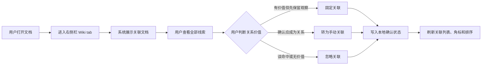
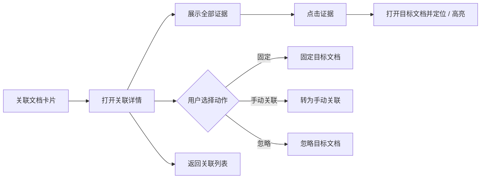
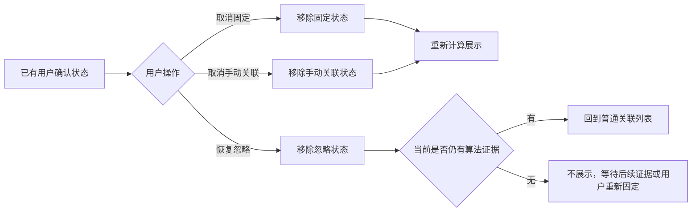
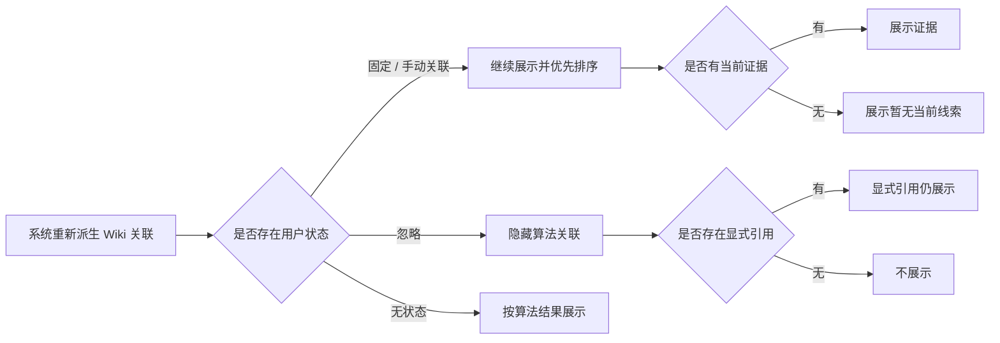

# Wiki 关联线索确认与固化 单功能需求规格说明书

> 文档元信息
> - 版本：v0.1 草稿
> - Owner：Lusice
> - 作者：Codex based on Lusice context
> - 最后更新：2026-05-18
> - 所属 PRD：`../PRD.md`
> - 功能路径：关系导航 / Wiki 关联线索确认与固化
> - 状态：draft

---

## 1. 功能概览

| 项目 | 内容 |
|---|---|
| 功能名称 | Wiki 关联线索确认与固化 |
| 优先级 | P0 |
| 功能使用者 | WorkKnowlage 桌面端用户 |
| 入口位置 | 编辑器右侧栏 / Wiki tab / 关联文档卡片 |
| 前置条件 | 用户已打开一个文档；右侧栏已派生当前文档的 Wiki 关联状态 |
| 相关模块 | RightSidebar、app-level association orchestration、local SQLite repository、block navigation |
| 相关文件 | `src/app/useSidebarAssociations.ts`、`src/shared/lib/sidebarAssociations.ts`、`src/features/shell/RightSidebar.tsx`、SQLite migration / repository |

## 2. 功能列表

| 序号 | 功能点 | 功能描述 | 优先级 |
|---:|---|---|---|
| 1 | 固定关联文档 | 用户可将某个算法发现的关联文档固定，后续优先展示 | P0 |
| 2 | 忽略关联文档 | 用户可隐藏某个误命中的关联文档，后续不再重复提示 | P0 |
| 3 | 转为手动关联 | 用户可将算法线索固化为显式的用户确认关系，不自动改写正文 | P0 |
| 4 | 查看全部线索 | 用户可从关联文档进入详情视图，查看该目标文档的全部相似证据和原文证据 | P0 |
| 5 | 关系状态标签 | 关联卡片展示 `已固定`、`手动关联`、`已忽略` 等状态标签 | P0 |
| 6 | 关系状态恢复 | 用户可取消固定、取消手动关联，或从已忽略列表恢复关联文档 | P0 |
| 7 | 排序与角标联动 | 用户确认的关系优先展示；已忽略关系不计入 Wiki tab 角标 | P0 |
| 8 | 本地持久化 | 用户确认状态保存到本地数据库，并随 workspace、source document、target document 绑定 | P0 |

## 3. 流程说明与流程图

本功能服务的目标不是继续扩大算法召回，而是让用户处理已经召回的 Wiki 关联线索。系统仍负责发现候选关联，用户负责判断这些线索是否有价值，并把有价值的关系沉淀为稳定的知识结构。固定和手动关联是正向确认；忽略是负向确认；查看全部线索用于帮助用户做判断。

### 3.1 主流程：确认并固化关联线索

用户打开文档后进入右侧栏 Wiki tab。系统展示显式引用和关联文档。用户看到某个关联文档后，可以先查看全部线索，再选择固定、忽略或转为手动关联。固定后的文档在后续打开当前文档时优先展示；手动关联进入用户确认关系层；忽略后的文档从普通关联列表隐藏，不再计入角标。

### 3.2 分支流程：查看全部线索

用户需要判断一个关联是否可信时，从关联文档卡片进入详情视图。详情视图在右侧栏内打开，不遮挡主编辑区，也不改变当前文档正文。详情中按证据类型展示 `原文命中`、`局部相似`、`主题相似`，每条证据可点击定位目标文档和命中块。用户可以返回列表，也可以直接在详情视图里固定、忽略或转为手动关联。

### 3.3 分支流程：恢复或撤销用户确认

用户确认状态必须可逆。已固定关系可以取消固定，手动关联可以取消，已忽略文档可以从 `已忽略` 入口恢复。恢复后系统重新按当前算法证据和用户状态计算展示；如果恢复时当前已经没有算法证据，该目标文档不应凭空出现在普通关联列表中，除非用户同时选择固定或手动关联。

### 3.4 分支流程：算法线索变化

用户确认状态的优先级高于算法临时结果。固定和手动关联即使暂时没有当前证据，也应继续展示，但要提示 `暂无当前线索`，避免用户误以为系统仍命中。已忽略关系即使算法再次命中，也默认隐藏；如果目标文档后来被用户显式引用，显式引用仍展示，因为用户动作高于忽略算法线索。

## 4. 特殊业务

1. 本功能的核心是“用户确认层”，不是新的召回算法。
2. 算法线索默认只是候选，不等同于用户已经认可的知识关系。
3. `固定关联` 表示用户希望持续看到该目标文档；不改变正文，也不把关系提升到显式引用区。
4. `转为手动关联` 表示用户确认 source document 与 target document 存在关系；当前版本不自动插入正文提及，避免静默修改文档内容。
5. 手动关联应在 Wiki 关系层被视为显式用户动作，可与文档提及、出链、反链同屏展示，但需要标识为 `手动关联`。
6. `忽略关联` 只影响算法派生的关联文档，不隐藏真正的文档提及、出链或反向链接。
7. 同一 source document 与 target document 之间同时只能有一个主状态：`pinned`、`manual`、`ignored` 或无状态。后一次用户动作覆盖前一次状态。
8. 已忽略文档需要可恢复，否则用户误操作会造成不可见关系。
9. Wiki tab 角标不统计已忽略目标；固定和手动关联应计入角标。
10. 用户确认状态只在当前 workspace 内生效，不跨 workspace。

## 5. 页面 / 状态说明

| 页面 / 状态 | 说明 | 可用操作 |
|---|---|---|
| Wiki 关联列表 | 显示显式引用和关联文档 | 打开文档、查看全部线索、固定、忽略、转为手动关联 |
| 关联文档卡片 - 普通 | 算法发现但用户未处理的目标文档 | 固定、忽略、转为手动关联、查看全部线索 |
| 关联文档卡片 - 已固定 | 用户固定过的目标文档 | 取消固定、查看全部线索、转为手动关联、打开目标 |
| 关联文档卡片 - 手动关联 | 用户确认的稳定关系 | 取消手动关联、查看全部线索、打开目标 |
| 关联详情视图 | 展示单个目标文档的全部证据 | 返回列表、点击证据、固定、忽略、转为手动关联 |
| 已忽略入口 | 展示当前文档下被忽略的目标文档数量 | 展开查看、恢复 |
| 暂无当前线索 | 固定或手动关联存在，但当前算法没有可展示证据 | 打开目标、取消状态、保留关系 |

## 6. 查询条件

本功能无用户输入查询条件。系统根据当前文档和当前 workspace 查询用户确认状态。

| 字段 | 类型 | 内容 | 默认值 | 查询精度 | 查询规则 |
|---|---|---|---|---|---|
| workspaceId | 系统上下文 | 当前 workspace | 当前空间 | 精确 | 只读取当前 workspace 的确认状态 |
| sourceDocumentId | 系统上下文 | 当前打开文档 | 当前文档 | 精确 | 作为关系来源 |
| targetDocumentId | 系统上下文 | 关联目标文档 | 无 | 精确 | 作为关系目标 |
| relationStatus | 系统状态 | pinned / manual / ignored | 无状态 | 精确 | 决定展示、排序和角标 |

## 7. 列表字段 / 状态字段

| 字段 | 内容 | 对齐 | 固定 | 排序 | 显示规则 |
|---|---|---|---|---|---|
| 目标文档标题 | target document title | 左 | 否 | 是 | 长标题截断或换行，不挤压操作区 |
| 关系状态标签 | 已固定 / 手动关联 / 已忽略 | 左 | 否 | 是 | 仅有状态时展示 |
| 证据标签 | 主题相似 / 局部相似 / 原文命中 | 左 | 否 | 是 | 与现有关联文档聚合规则一致 |
| 证据数量摘要 | `N 处相似` / `N 条线索` | 左 | 否 | 是 | 无当前证据时显示 `暂无当前线索` |
| 操作入口 | 固定、忽略、转为手动关联、查看全部线索 | 右 | 是 | 否 | 使用菜单或图标按钮承载，避免卡片过拥挤 |
| 已忽略数量 | 当前文档下被忽略目标数量 | 左 | 否 | 否 | 数量大于 0 时展示入口 |

排序规则：

1. 手动关联优先于固定关联。
2. 固定关联优先于普通算法关联。
3. 普通算法关联中，有原文命中的目标优先于纯相似目标。
4. 同级内按证据数量和现有相似分排序。
5. 已忽略目标默认不在主列表展示。

## 8. 表单字段

本版本不提供备注输入，因此无必填表单字段。后续如支持关系备注，应单独进入 SPEC 变更。

| 字段 | 类型 | 内容 | 默认值 | 格式规则 |
|---|---|---|---|---|
| 关系状态 | 枚举 | pinned / manual / ignored | 无状态 | 用户操作产生，不允许空 targetDocumentId |

## 9. 交互说明

| 交互 | 说明 |
|---|---|
| 页面加载 | 读取 prepared association state 和本地用户确认状态，合并生成展示模型 |
| 点击固定 | 将当前 source-target 关系写为 pinned，并刷新卡片状态 |
| 取消固定 | 移除 pinned 状态；若当前仍有算法证据，回到普通关联；若无证据则隐藏 |
| 点击忽略 | 二次确认后写为 ignored；目标文档从普通关联列表隐藏，不计入角标 |
| 恢复忽略 | 移除 ignored 状态；若当前仍有算法证据，回到普通关联 |
| 转为手动关联 | 写为 manual；展示为用户确认关系，不自动插入正文提及 |
| 取消手动关联 | 移除 manual 状态；按当前证据重新计算展示 |
| 查看全部线索 | 在右侧栏打开关联详情视图，列出该目标文档的全部证据 |
| 点击证据 | 打开目标文档并定位 blockId；存在 matchedText 或 searchText 时高亮原文 |
| 切换文档 | 清理详情视图和 hover 状态，读取新 source document 的确认状态 |
| 删除目标文档 | 不展示已删除目标；确认状态可保留在数据库中，后续清理任务处理 |

## 10. 提示说明

| 场景 | 提示类型 | 提示文本 |
|---|---|---|
| 固定成功 | toast | 已固定关联文档 |
| 取消固定 | toast | 已取消固定 |
| 手动关联成功 | toast | 已转为手动关联 |
| 取消手动关联 | toast | 已取消手动关联 |
| 忽略确认 | confirm | 忽略后该关联文档将不再作为算法线索提示，可从已忽略中恢复。 |
| 忽略成功 | toast | 已忽略该关联文档 |
| 恢复忽略 | toast | 已恢复该关联文档 |
| 暂无当前线索 | inline | 该关系由你固定或确认，但当前暂无新的算法线索。 |
| 已忽略入口为空 | 空状态 | 暂无已忽略关联 |

## 11. 异常处理

| 异常场景 | 系统处理 | 用户反馈 | 是否阻塞 |
|---|---|---|---|
| 确认状态写入失败 | 保持原展示状态，不更新本地状态 | 提示“保存关联状态失败，请重试” | 否 |
| 目标文档已删除 | 主列表隐藏该目标；详情不可打开 | 不展示或显示不可用状态 | 否 |
| source document 不存在 | 不读取确认状态 | 展示未选择文稿状态 | 否 |
| 状态冲突 | 以后一次用户动作为准，覆盖旧状态 | 不额外打扰用户 | 否 |
| blockId 不存在 | 打开目标文档，使用 fallbackText / matchedText 尝试定位 | 可提示未找到精确位置 | 否 |
| 证据解析失败 | 展示用户确认关系，证据区降级为暂无当前线索 | 不影响打开文档 | 否 |
| migration 失败 | 不启用确认状态层，保留算法关联展示 | 启动或日志层处理，不能影响内容编辑 | 否 |

## 12. 数据记录

| 数据项 | 来源 | 存储位置 | 用途 |
|---|---|---|---|
| workspaceId | workspace session | `wiki_association_decisions` | 限定关系作用域 |
| sourceDocumentId | 当前文档 | `wiki_association_decisions` | 关系来源 |
| targetDocumentId | 用户操作目标 | `wiki_association_decisions` | 关系目标 |
| status | 用户操作 | `wiki_association_decisions` | pinned / manual / ignored |
| createdAt | repository | `wiki_association_decisions` | 审计和排序辅助 |
| updatedAt | repository | `wiki_association_decisions` | 状态刷新和冲突覆盖 |
| derived evidence | association engine | prepared association state | 展示当前算法线索 |
| merged association view model | app-level hook | React state / selector | RightSidebar 渲染最终列表 |

建议数据约束：

1. `(workspaceId, sourceDocumentId, targetDocumentId)` 唯一。
2. `sourceDocumentId` 与 `targetDocumentId` 不允许相同。
3. `status` 只允许 `pinned`、`manual`、`ignored`。
4. 删除文档不立即级联删除确认状态，避免误删恢复后状态丢失；可由后续维护任务清理孤儿记录。

## 13. 权限与边界

1. 本功能只保存本地用户确认状态，不联网、不上传内容。
2. 本功能不改变算法召回规则，只改变展示合并、排序、过滤和持久化状态。
3. 当前版本不自动改写正文，不自动插入 `@文档` 提及。
4. 当前版本不支持关系备注、关系类型自定义或图谱编辑。
5. 当前版本不跨 workspace 展示或同步确认状态。
6. 已忽略只影响算法关联文档，不影响用户显式提及、出链、反链和手动关联。

## 14. 验收标准

1. 用户可以在关联文档卡片上固定目标文档；刷新或切换文档后固定状态仍存在。
2. 固定目标文档在当前文档 Wiki 关联列表中优先展示，并显示 `已固定`。
3. 用户可以取消固定；取消后按当前算法证据回到普通展示或隐藏。
4. 用户可以忽略目标文档；忽略后目标从普通关联列表消失，不计入 Wiki tab 角标。
5. 用户可以从已忽略入口恢复目标文档。
6. 用户可以将目标文档转为手动关联；手动关联优先展示并显示 `手动关联`。
7. 手动关联不会自动修改当前文档正文。
8. 用户可以从关联文档打开全部线索详情，并看到原文命中、局部相似和主题相似证据。
9. 点击详情中的原文证据能打开目标文档并高亮 matchedText。
10. 固定或手动关联在当前证据消失时仍可展示，并提示 `暂无当前线索`。
11. 已忽略目标如果存在真实文档提及或反向链接，显式引用仍正常展示。
12. `npm run typecheck`、相关 unit tests、repository migration tests 和 RightSidebar rendering tests 通过。

## 15. 待确认问题

本版本无阻塞待确认问题。已决策：

1. 当前版本先做文档级确认状态，不做证据级采纳 / 忽略。
2. `转为手动关联` 不自动插入正文提及，避免静默修改用户文档。
3. 关系备注、关系类型自定义、图谱编辑放入后续版本。

## 16. 变更记录

| 版本 | 作者 | 修订内容 | 日期 |
|---|---|---|---|
| v0.1 | Codex | 初稿，定义 Wiki 关联线索确认、固化、忽略和详情查看规则 | 2026-05-18 |
