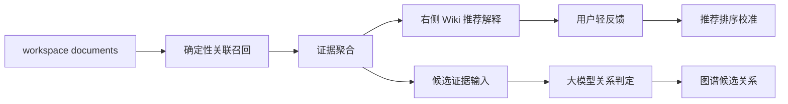
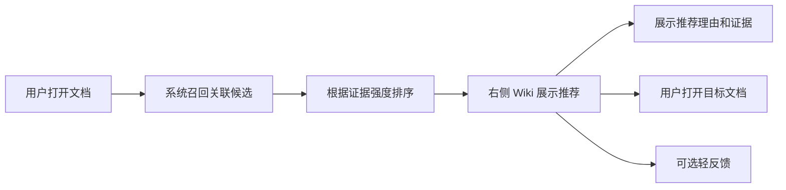
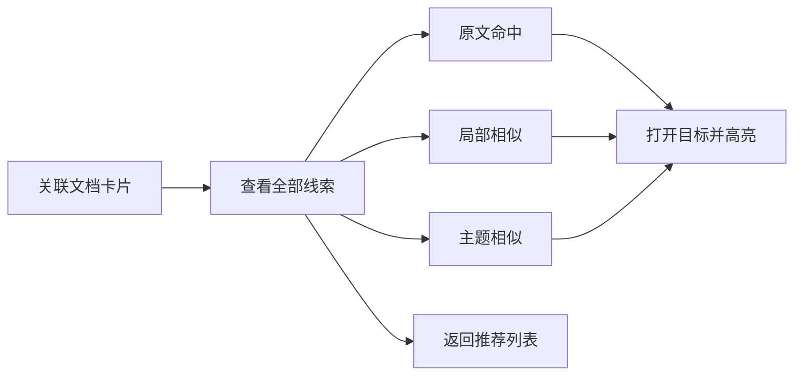
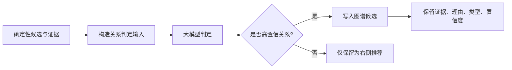
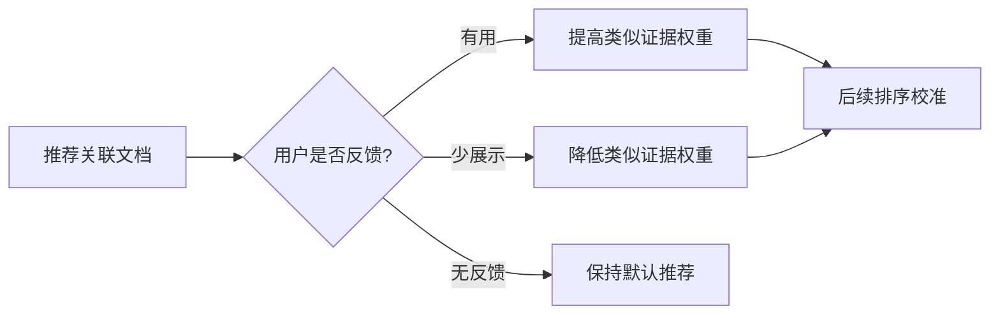

# Wiki 关联推荐与智能判定 单功能需求规格说明书

> 文档元信息
> - 版本：v0.3 草稿
> - Owner：Lusice
> - 作者：Codex based on Lusice context
> - 最后更新：2026-05-18
> - 所属 PRD：`../PRD.md`
> - 功能路径：关系导航 / Wiki 关联推荐与智能判定
> - 状态：draft

---

## 1. 功能概览

| 项目 | 内容 |
|---|---|
| 功能名称 | Wiki 关联推荐与智能判定 |
| 优先级 | P0 / P1 分层 |
| 功能使用者 | WorkKnowlage 桌面端用户 |
| 入口位置 | 编辑器右侧栏 / Wiki tab / 未来图谱视图 |
| 前置条件 | 用户已打开一个文档；系统已派生同 workspace 内的显式引用、相似证据和原文命中 |
| 相关模块 | RightSidebar、association orchestration、LLM relation judgement、graph data layer、block navigation |
| 相关文件 | `src/app/useSidebarAssociations.ts`、`src/shared/lib/sidebarAssociations.ts`、`src/features/shell/RightSidebar.tsx`、未来 AI relation service / graph repository |

## 2. 功能列表

| 序号 | 功能点 | 功能描述 | 优先级 |
|---:|---|---|---|
| 1 | 推荐解释 | 右侧 Wiki 对关联文档展示证据类型、命中原文和推荐理由 | P0 |
| 2 | 低打扰反馈 | 用户可选择“少展示类似内容”或“这个有用”，但不需要逐条审核 | P0 |
| 3 | 证据详情 | 用户可查看某个关联文档的全部原文命中、局部相似和主题相似证据 | P0 |
| 4 | 推荐降噪 | 系统根据确定性规则、证据强度和用户轻反馈调整展示顺序 | P0 |
| 5 | 智能关系判定 | 大模型根据候选文档、证据片段和上下文判断是否存在有效知识关系 | P1 |
| 6 | 关系类型识别 | 大模型输出关系类型，例如引用、补充、同主题、问题-方案、需求-缺陷 | P1 |
| 7 | 图谱候选生成 | 高置信智能判定结果进入图谱候选层，供未来图谱视图使用 | P1 |
| 8 | 可解释审计 | 智能判定结果保留证据片段、理由、置信度和模型来源 | P1 |

### 2.1 背景与目标

P0.2 已经让右侧 Wiki 能展示关联文档，并将 `主题相似`、`局部相似`、`原文命中` 聚合到目标文档下。短句、列表项和关键句原文命中也已经能作为线索召回。

上一版 P0.3 设计曾把重点放在“用户确认与固化”，这会把右侧 Wiki 从推荐辅助变成审核任务，增加用户操作负担。更准确的产品方向是：右侧 Wiki 负责推荐和解释；如果要形成有效关联图谱，应由大模型在后台进行关系判定，而不是要求用户逐条手动确认。

本功能目标：

1. 右侧 Wiki 保持推荐体验，不变成待处理队列。
2. 用户可以理解为什么推荐某个文档，包括证据类型、命中原文和简短理由。
3. 用户可以查看某个目标文档的全部线索，而不是只依赖 hover 小浮层。
4. 用户反馈保持轻量可选，只用于推荐排序和降噪。
5. 面向未来图谱，建立“大模型关系判定”路径：判断关系是否成立、关系类型、置信度和理由。

### 2.2 方案取舍

| 方案 | 内容 | 结论 | 原因 |
|---|---|---|---|
| 用户逐条确认 | 固定、忽略、手动关联每个推荐关系 | 不采用为主流程 | 会把右侧 Wiki 变成审核任务，增加操作负担 |
| 推荐解释 + 轻反馈 | 展示推荐理由、全部线索和可选反馈 | P0 采用 | 符合右侧 Wiki 的推荐辅助定位 |
| 推荐解释 + 大模型判定 | 系统在后台判断关系有效性、类型和置信度 | P1 采用 | 适合为图谱提供高可信关系候选 |

当前版本先落地推荐解释和全部线索详情。大模型判定需要单独明确模型配置、数据发送边界和用户授权后再进入实现。

### 2.3 产品形态

右侧 Wiki 保持两层结构：

1. 显式引用：文档提及、出链、反链，来自用户真实内容动作。
2. 推荐关联文档：系统基于相似和原文证据生成的推荐。

推荐关联文档卡片增加：

1. 推荐理由：例如 `命中关键句`、`3 条原文线索`、`主题相似`。
2. 全部线索入口：进入右侧栏详情视图，按证据类型分组展示。
3. 轻反馈入口：`有用`、`少展示类似内容`，可选且低打扰。
4. 智能判定状态预留：未来展示 `可能形成图谱关系`、关系类型和置信度。

### 2.4 数据流



P0.3 可以只做到 `Evidence -> Wiki` 和轻反馈 UI 预留，不强制实现大模型。模型能力要单独评审数据边界。

### 2.5 大模型判定边界

大模型判定不是“语义搜索替代品”，而是对已经召回的候选关系做二次判断。输入应尽量小而可解释：

1. 当前文档标题和相关片段。
2. 目标文档标题和命中片段。
3. 证据类型：原文命中、局部相似、主题相似、显式引用。
4. 需要模型输出：是否成关系、关系类型、置信度、理由、引用证据。

未配置模型时，WorkKnowlage 仍正常展示本地确定性推荐；不能因为模型不可用影响编辑和阅读。

## 3. 流程说明与流程图

本功能的产品目标是让右侧 Wiki 成为“推荐和解释面板”，而不是让用户承担关系审核任务。系统先用确定性规则召回候选，再由右侧栏向用户解释为什么推荐。若目标是形成可用的关联图谱，关系确认的主路径应由大模型承担：大模型根据候选证据判断关系是否成立、属于什么类型、置信度如何，并把结果沉淀为图谱候选。用户反馈只是低打扰校准信号，不是必须完成的闭环动作。

### 3.1 主流程：查看 Wiki 推荐

用户打开文档后，右侧栏 Wiki tab 展示显式引用和推荐关联文档。关联文档按目标文档聚合证据，用户可以直接打开目标文档，也可以查看全部线索。右侧栏不要求用户逐条固定、确认或手动转关系；它只提供推荐解释和必要的轻反馈入口。



### 3.2 分支流程：查看全部线索

当用户需要判断某个推荐是否有价值时，可以打开该关联文档的线索详情。详情在右侧栏内展示，不遮挡主编辑区。系统按证据类型分组展示 `原文命中`、`局部相似` 和 `主题相似`，每条证据都能点击回到目标文档命中位置并高亮原文。



### 3.3 分支流程：大模型关系判定

系统在后台或用户允许后，将候选关联文档及其证据片段交给大模型判定。大模型不替代原始证据，而是在证据之上输出关系是否成立、关系类型、置信度和简短理由。只有达到阈值的结果进入图谱候选层；低置信结果只继续作为右侧推荐，不进入图谱。



### 3.4 分支流程：用户轻反馈

用户反馈不应成为使用右侧 Wiki 的必经环节。用户可以对推荐进行“有用”或“少展示类似内容”的轻量反馈，系统将其用于排序和降噪。反馈不直接等同于建立知识关系，也不强迫用户在每条推荐上做确认。



## 4. 特殊业务

1. 右侧 Wiki 是推荐面板，不是待审核任务列表。
2. 用户不需要逐条手动确认，系统也不应把推荐变成用户负担。
3. 有效关联图谱的主确认路径应由大模型关系判定承担，而不是要求用户手动固化。
4. 短句原文命中、标题式短语命中和关键句命中仍属于证据层，不直接等同于图谱关系。
5. 显式引用、文档提及和反向链接是用户真实内容动作，优先级高于模型推断关系。
6. 大模型判定必须保留证据、理由、置信度和模型来源，不能只写入一个不可解释的关系边。
7. 如果没有启用大模型能力，系统仍应提供确定性推荐和证据解释，但不承诺形成可靠图谱。
8. 用户轻反馈只用于推荐排序和降噪，不作为建立图谱关系的必要步骤。

## 5. 页面 / 状态说明

| 页面 / 状态 | 说明 | 可用操作 |
|---|---|---|
| Wiki 推荐列表 | 展示显式引用和推荐关联文档 | 打开目标文档、查看全部线索、轻反馈 |
| 关联文档卡片 | 按目标文档聚合证据 | 打开目标、查看全部线索 |
| 全部线索详情 | 展示该目标文档的全部证据 | 点击证据定位、高亮、返回 |
| 智能判定中 | 后台正在判定候选关系 | 不阻塞阅读和编辑 |
| 智能判定结果 | 展示关系类型、置信度和理由 | 查看证据、打开目标 |
| 仅推荐未入图谱 | 候选证据不足或模型低置信 | 保持推荐展示，不进入图谱 |
| 无大模型能力 | 未配置或未启用模型 | 展示确定性推荐，不显示智能判定承诺 |

## 6. 查询条件

本功能无用户输入查询条件。推荐和判定基于当前文档、同 workspace 文档、证据片段、显式引用和可选模型能力自动生成。

| 字段 | 类型 | 内容 | 默认值 | 查询精度 | 查询规则 |
|---|---|---|---|---|---|
| 当前文档 | 系统上下文 | activeDocument | 当前文档 | 精确 | 作为推荐源 |
| 当前 workspace | 系统上下文 | activeDocument.spaceId | 当前空间 | 精确 | 不跨 workspace |
| 候选证据 | 派生数据 | 原文命中、局部相似、主题相似 | 空 | 证据级 | 作为推荐解释和模型输入 |
| 模型配置 | 用户设置 / 系统能力 | 是否启用大模型判定 | 关闭 | 精确 | 未启用时不运行智能判定 |

## 7. 列表字段 / 状态字段

| 字段 | 内容 | 对齐 | 固定 | 排序 | 显示规则 |
|---|---|---|---|---|---|
| 目标文档标题 | 推荐关联文档标题 | 左 | 否 | 是 | 长标题截断或换行 |
| 证据标签 | 主题相似 / 局部相似 / 原文命中 | 左 | 否 | 是 | 与现有证据分层一致 |
| 推荐理由 | 系统生成的简短解释 | 左 | 否 | 是 | 优先展示最强证据原因 |
| 证据数量摘要 | `N 处相似` / `N 条线索` | 左 | 否 | 是 | 聚合展示 |
| 智能关系类型 | 引用 / 补充 / 同主题 / 问题-方案等 | 左 | 否 | 是 | 仅模型判定后展示 |
| 置信度 | 高 / 中 / 低，或内部 score 映射 | 左 | 否 | 是 | 面向用户用分档，不裸露复杂分数 |
| 轻反馈状态 | 有用 / 少展示类似内容 | 右 | 否 | 否 | 非必填、低打扰 |

排序规则：

1. 显式引用优先于推荐关联。
2. 智能高置信关系优先于普通推荐。
3. 普通推荐中，有原文命中的目标优先于纯相似目标。
4. 同级内按证据数量、证据质量和现有相似分排序。
5. 用户负反馈只降低类似推荐权重，不隐藏显式引用。

## 8. 表单字段

当前版本不提供重表单。大模型能力配置应在独立 AI 设置或智能辅助专项 SPEC 中定义。

| 字段 | 类型 | 内容 | 默认值 | 格式规则 |
|---|---|---|---|---|
| 轻反馈 | 枚举 | useful / less_like_this | 无 | 可撤销或被后续反馈覆盖 |
| 智能判定状态 | 枚举 | pending / accepted / rejected / unavailable | unavailable | 系统生成，不由用户手填 |

## 9. 交互说明

| 交互 | 说明 |
|---|---|
| 页面加载 | 展示确定性推荐和显式引用，不等待大模型 |
| 查看全部线索 | 在右侧栏内打开详情，不遮挡主编辑区 |
| 点击证据 | 打开目标文档并定位 blockId；存在 matchedText 或 searchText 时高亮 |
| 点击有用 | 记录轻反馈，提高类似证据权重 |
| 点击少展示类似内容 | 记录轻反馈，降低类似证据权重 |
| 智能判定完成 | 若仍在当前文档，刷新关系类型、置信度和理由 |
| 模型不可用 | 不展示错误弹窗，降级为确定性推荐 |
| 切换文档 | 清理详情视图，读取新文档推荐和判定状态 |

## 10. 提示说明

| 场景 | 提示类型 | 提示文本 |
|---|---|---|
| 无关联文档 | 空状态 | 暂未发现关联文档 |
| 无大模型能力 | 行内说明 | 当前仅展示本地证据推荐 |
| 智能判定中 | 状态 | 正在判断关系 |
| 高置信关系 | 状态 | 可能形成图谱关系 |
| 低置信关系 | 状态 | 仅作为推荐参考 |
| 轻反馈成功 | toast | 已用于优化后续推荐 |

## 11. 异常处理

| 异常场景 | 系统处理 | 用户反馈 | 是否阻塞 |
|---|---|---|---|
| 模型未配置 | 跳过智能判定 | 展示本地证据推荐 | 否 |
| 模型调用失败 | 保留确定性推荐，记录失败状态 | 不弹阻塞错误 | 否 |
| 候选证据过长 | 截取最相关片段输入模型 | 不影响推荐展示 | 否 |
| 模型输出无法解析 | 丢弃本次智能判定结果 | 保留普通推荐 | 否 |
| 目标文档已删除 | 不展示推荐或图谱候选 | 无需打扰用户 | 否 |
| blockId 不存在 | 打开目标文档，使用 fallbackText 尝试定位 | 可提示未找到精确位置 | 否 |

## 12. 数据记录

| 数据项 | 来源 | 存储位置 | 用途 |
|---|---|---|---|
| sourceDocumentId | 当前文档 | association state / future graph table | 关系来源 |
| targetDocumentId | 推荐目标 | association state / future graph table | 关系目标 |
| evidence | 确定性召回 | prepared association state | 推荐解释和模型输入 |
| relationType | 大模型判定 | future relation judgement table | 图谱候选类型 |
| confidence | 大模型判定 | future relation judgement table | 是否进入图谱候选 |
| rationale | 大模型判定 | future relation judgement table | 可解释展示 |
| modelProvider | 模型配置 | future relation judgement table | 审计和可复现边界 |
| userFeedback | 用户轻反馈 | future recommendation feedback table | 排序和降噪 |

## 13. 权限与边界

1. 当前 P0 可以只做确定性推荐解释和证据详情，不强依赖大模型。
2. 大模型判定进入 P1 / 智能辅助范围，必须先明确模型配置、数据发送边界和用户授权。
3. 未经用户允许，不应把本地文档内容发送到外部模型服务。
4. 大模型判定结果不能覆盖显式引用和用户正文内容。
5. 图谱候选应保留证据和置信度，不能只保留不可解释的边。
6. 本功能不做逐条手动确认闭环，不把右侧 Wiki 变成审核队列。

## 14. 验收标准

1. 右侧 Wiki 推荐列表不要求用户逐条固定或确认。
2. 推荐关联文档能展示证据标签、数量摘要和简短推荐理由。
3. 用户可以打开全部线索详情，并按证据类型查看原文命中、局部相似和主题相似。
4. 点击原文证据能打开目标文档并高亮 matchedText。
5. 用户轻反馈是可选动作，不影响基础推荐浏览。
6. 未启用大模型时，系统降级为本地确定性推荐，不承诺图谱关系。
7. 启用大模型后，高置信关系判定能输出关系类型、理由和置信度。
8. 低置信模型结果不进入图谱候选，只保留为普通推荐参考。
9. 显式引用始终优先展示，不被模型低置信或用户负反馈隐藏。
10. `npm run typecheck`、相关 unit tests、RightSidebar rendering tests 和智能判定服务 tests 通过。

## 15. 待确认问题

1. > ⚠️ 待确认：大模型判定优先接入本地模型、用户自带 API Key，还是项目内置远程模型配置？
2. > ⚠️ 待确认：图谱候选的关系类型枚举是否先限定为引用、补充、同主题、问题-方案、需求-缺陷五类？
3. > ⚠️ 待确认：大模型判定结果是否默认写入本地缓存，还是仅在图谱功能开启后写入？

## 16. 实施拆解

本节是实现期参考，不替代 PRD / SPEC 的产品定义。当前建议先做右侧推荐解释和证据详情，再预留大模型关系判定边界；不在 P0.3 中直接接入远程模型。

### 16.1 Task 1：推荐理由 View Model

目标：在关联文档 view model 中补充推荐理由和证据强度，让 UI 可以解释“为什么推荐”。

涉及文件：

1. `src/shared/lib/sidebarAssociations.ts`
2. `src/shared/lib/sidebarAssociations.test.ts`

实施步骤：

1. 给 `SidebarAssociatedDocument` 增加字段：
   - `recommendationReason: string`
   - `evidenceStrength: 'high' | 'medium' | 'low'`
2. 根据证据生成推荐理由：
   - 有原文证据：优先显示 `命中关键句` 或 `${count} 条原文线索`。
   - 有局部相似：显示 `局部内容相似`。
   - 只有主题相似：显示 `主题相似`。
3. 保持现有 evidence badges 不变；推荐理由是解释文案，不是新的证据类型。
4. 增加测试：
   - 原文命中生成推荐理由。
   - 原文命中 + 相似证据混合时优先解释强证据。
   - 只有主题相似时生成主题相似理由。

验证命令：

```bash
rtk npm test -- src/shared/lib/sidebarAssociations.test.ts
```

建议提交：

```bash
git add src/shared/lib/sidebarAssociations.ts src/shared/lib/sidebarAssociations.test.ts
git commit -m "feat: explain wiki association recommendations"
```

### 16.2 Task 2：全部线索详情视图

目标：让用户能在右侧栏内查看某个关联文档的完整证据，而不是只能依赖 hover 小浮层。

涉及文件：

1. `src/features/shell/RightSidebar.tsx`
2. `src/features/shell/RightSidebar.test.tsx`

实施步骤：

1. 在 `RightSidebar` 中增加 `detailAssociatedDocumentId` 本地状态。
2. 在关联文档卡片上增加紧凑的 `查看全部线索 <title>` 图标按钮。
3. 当 `detailAssociatedDocumentId` 存在时，在右侧栏 Wiki 区域内渲染详情视图：
   - 返回按钮。
   - 目标文档标题。
   - 推荐理由。
   - `原文命中` 分组。
   - `局部相似 / 主题相似` 分组。
4. 复用现有证据点击行为：
   - `blockId`
   - `fallbackText`
   - `highlightQuery`
5. 不使用弹窗或遮罩；详情视图应留在右侧栏内，避免打断主编辑区。
6. 增加测试：
   - 从卡片打开详情。
   - 详情渲染原文证据和相似证据。
   - 点击原文证据时带 `highlightQuery`。
   - 返回推荐列表。

验证命令：

```bash
rtk npm test -- src/features/shell/RightSidebar.test.tsx
```

建议提交：

```bash
git add src/features/shell/RightSidebar.tsx src/features/shell/RightSidebar.test.tsx
git commit -m "feat: show full wiki association evidence"
```

### 16.3 Task 3：可选轻反馈

目标：提供低打扰反馈入口，用于排序和降噪，不把反馈变成必经确认流程。

涉及文件：

1. `src/app/useWikiRecommendationFeedback.ts`
2. `src/app/useWikiRecommendationFeedback.test.tsx`
3. `src/features/shell/AppShell.tsx`
4. `src/features/shell/RightSidebar.tsx`
5. `src/features/shell/RightSidebar.test.tsx`

实施步骤：

1. 增加 `useWikiRecommendationFeedback` hook，先使用组件状态保存反馈：
   - key：`sourceDocumentId + targetDocumentId`
   - value：`useful | less_like_this`
2. 暴露回调：
   - `markUseful(targetDocumentId)`
   - `showLessLikeThis(targetDocumentId)`
3. 从 `AppShell` 将反馈状态和回调传给 `RightSidebar`。
4. 在右侧栏增加小图标动作：
   - `这个推荐有用 <title>`
   - `少展示类似推荐 <title>`
5. 用户不反馈也可以正常打开目标文档。
6. 反馈只影响当前会话展示顺序：
   - `useful` 可以上浮。
   - `less_like_this` 可以下沉。
   - 显式引用不受影响。
7. 增加测试：
   - 点击反馈时调用回调。
   - `less_like_this` 降低推荐优先级或展示权重。
   - 反馈动作不阻断打开目标文档。

验证命令：

```bash
rtk npm test -- src/app/useWikiRecommendationFeedback.test.tsx src/features/shell/RightSidebar.test.tsx
```

建议提交：

```bash
git add src/app/useWikiRecommendationFeedback.ts src/app/useWikiRecommendationFeedback.test.tsx src/features/shell/AppShell.tsx src/features/shell/RightSidebar.tsx src/features/shell/RightSidebar.test.tsx
git commit -m "feat: add lightweight wiki recommendation feedback"
```

### 16.4 Task 4：大模型判定边界类型

目标：先定义未来大模型关系判定的数据边界，不在本阶段发起模型调用。

涉及文件：

1. `src/shared/lib/wikiRelationJudgement.ts`
2. `src/shared/lib/wikiRelationJudgement.test.ts`

实施步骤：

1. 增加纯 TypeScript 类型：
   - `WikiRelationCandidate`
   - `WikiRelationEvidence`
   - `WikiRelationJudgementResult`
   - `WikiRelationType`
2. 增加纯 helper：`buildWikiRelationCandidate`。
3. 输入包括 source document、target document 和证据片段。
4. 不调用任何模型。
5. 不加入 API key、provider config 或网络请求。
6. 增加测试，确认 candidate payload：
   - 包含 source / target IDs。
   - 只包含受限长度的证据片段。
   - 保留 evidence type。

验证命令：

```bash
rtk npm test -- src/shared/lib/wikiRelationJudgement.test.ts
```

建议提交：

```bash
git add src/shared/lib/wikiRelationJudgement.ts src/shared/lib/wikiRelationJudgement.test.ts
git commit -m "feat: prepare wiki relation judgement boundary"
```

### 16.5 Task 5：验证与验收记录

目标：完成 P0.3 代码后的自动化验证和手工验收记录。

建议新增文件：

1. `docs/plans/2026-05-18-p0-3-wiki-association-intelligent-judgement-verification.md`

聚焦测试：

```bash
rtk npm test -- src/shared/lib/sidebarAssociations.test.ts src/features/shell/RightSidebar.test.tsx src/app/useWikiRecommendationFeedback.test.tsx src/shared/lib/wikiRelationJudgement.test.ts
```

全量测试：

```bash
rtk npm test
```

类型检查：

```bash
rtk npm run typecheck
```

手工 smoke：

1. 打开 `测试文档`。
2. 确认 Wiki 推荐仍能显示关联文档。
3. 确认关联卡片解释为什么推荐。
4. 打开全部线索详情。
5. 点击原文证据并确认目标文档打开、原文高亮。
6. 使用轻反馈，确认不阻断文档导航。

建议提交：

```bash
git add docs/plans/2026-05-18-p0-3-wiki-association-intelligent-judgement-verification.md
git commit -m "docs: verify wiki association recommendation"
```

### 16.6 Non-Goals

1. 不要求用户手动确认每一条推荐关系。
2. 不实现固定 / 忽略 / 手动关联持久化作为本阶段主路径。
3. 在模型配置和数据权限明确前，不调用远程模型。
4. 不在本阶段构建图谱视图。
5. 不通过继续调低语义相似阈值来替代关系判定。

## 17. 变更记录

| 版本 | 作者 | 修订内容 | 日期 |
|---|---|---|---|
| v0.1 | Codex | 初稿，改为右侧推荐解释 + 大模型智能判定方向，取消用户手动确认作为主闭环 | 2026-05-18 |
| v0.2 | Codex | 合并设计说明到 SPEC，删除独立设计 / 实现计划长期文档 | 2026-05-18 |
| v0.3 | Codex | 将完整设计背景和实现拆解合并回 SPEC，避免合并过程丢失细节 | 2026-05-18 |
